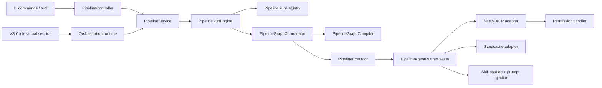

# Étude d’architecture — moteur pipeline ACP

**Date** : 2026-07-19  
**Branche étudiée** : `agent/interactive-grill-skeleton-tdd`  
**Contexte GitHub** : la PR #9 a été fusionnée dans cette branche, qui est la branche tête de la PR #8 encore ouverte.

## 1. Objectif et méthode

Cette étude vérifie et complète la review de la PR #9 en appliquant le vocabulaire de `.agents/skills/codebase-design/SKILL.md` :

- **Module** : élément qui possède une **Interface** et une **Implementation**.
- **Interface** : tout ce qu’un appelant doit connaître, y compris invariants, ordre des appels, erreurs et contraintes de performance.
- **Seam** : emplacement où vit l’Interface d’un Module.
- **Adapter** : implémentation concrète qui occupe un Seam.
- **Depth** : capacité offerte derrière une Interface réduite.
- **Leverage** : bénéfice obtenu par les appelants grâce à la Depth.
- **Locality** : concentration des changements et des vérifications dans un seul Module.

Les critères utilisés sont :

1. le test de suppression : où la complexité réapparaît-elle si le Module disparaît ?
2. l’Interface comme surface de test ;
3. l’existence d’au moins deux Adapters avant d’exposer un Seam ;
4. la séparation entre Seams externes et Seams internes ;
5. la classification des dépendances : in-process, local-substitutable, remote-owned ou true external.

## 2. Périmètre inspecté

L’étude porte principalement sur :

- `acp-pipeline/src/PipelineService.ts`
- `acp-pipeline/src/PipelineRunEngine.ts`
- `acp-pipeline/src/PipelineGraphCompiler.ts`
- `acp-pipeline/src/engine/PipelineGraphCoordinator.ts`
- `acp-pipeline/src/PipelineExecutor.ts`
- `acp-pipeline/src/PipelineRunRegistry.ts`
- `acp-pipeline/src/PipelineTypes.ts`
- `acp-pipeline/src/engine/PipelineRoleLabels.ts`
- `plugin-pi/src/runtime/pipelineController.ts`
- `plugin-pi/src/acp/ephemeralRunner.ts`
- `plugin-pi/src/acp/permissionHandler.ts`
- `plugin-pi/src/catalog/skillCatalog.ts`
- `plugin-pi/.acp/pipelines/grill-spec-tickets-implement-review.yaml`
- `plugin-vscode/src/core/SessionManager.ts`
- `plugin-vscode/src/core/VirtualSessionRuntime.ts`
- ADR-0015, ADR-0017, ADR-0018 et ADR-0019.

## 3. Architecture actuelle

Le découpage monorepo est sain : `@acp-client/pipeline` ne connaît ni VS Code, ni Pi, ni le filesystem concret, ni Sandcastle. Les hôtes injectent un runner et projettent les événements vers leur UI. Cette séparation donne déjà de la Locality au moteur d’orchestration.

La faiblesse principale n’est donc pas la position générale des packages, mais la forme de plusieurs Interfaces internes et publiques.

## 4. Vérification des constats de la PR #9

### 4.1 Constat confirmé — la vérité du cycle de vie est divisée

`PipelineService.createPlan()` et `PipelineService.approvePlan()` retournent uniquement `Promise<string>`. La distinction entre pause et fin réelle est transmise par l’événement `plan-ready`.

Le contrôleur Pi doit donc connaître un invariant implicite :

> après l’appel au moteur, vérifier si un événement a modifié `pendingPlan` avant de décider si le run est terminé.

`runPipeline()` applique ce contournement, mais `approve()` annonce toujours `ACP Pipeline Completed` puis supprime `activeSessionId`, même si le moteur vient d’émettre une nouvelle pause.

La complexité du cycle de vie fuit derrière le Seam du moteur. Le Module `PipelineService` n’est pas assez profond sur ce point : l’appelant doit combiner une valeur retournée, des événements et un état mutable local pour comprendre le résultat.

**Sévérité** : bloquante pour les pipelines à plusieurs approvals.

### 4.2 Constat confirmé — une approval est modélisée comme un plan

Les noms publics et internes sont spécialisés :

- `PipelinePlanReadyEvent`
- `approvePlan()`
- `rejectPlan()`
- `PendingApprovalState.plan`
- `assertSingleProposedPlan()`

Pour approuver une spécification et une liste de tâches, le YAML doit donc emballer du Markdown arbitraire dans `<proposed_plan>`. Le contrat de transport devient un contrat métier artificiel.

La seconde approval n’est pas un nouveau cas marginal : elle révèle que le Seam actuel a été placé autour du premier workflow historique plutôt qu’autour du concept général de pause humaine.

### 4.3 Constat confirmé — `sideEffects: none` n’est pas une politique exécutoire pour ACP natif

`PipelineExecutor` transmet `sideEffects` et `permissions` au runner. Dans `EphemeralAcpRunner` :

- Sandcastle rejette automatiquement le worktree quand `sideEffects !== "workspace"` ;
- l’Adapter ACP natif transmet seulement `permissions` au client ;
- `PermissionHandler` auto-approuve les demandes quand `permissions === "allowAll"`.

Le filesystem natif et le terminal ne reçoivent pas une politique dérivée de `sideEffects`. La promesse read-only dépend donc du prompt et non de l’Implementation.

La dépendance est de catégorie **local-substitutable** pour le filesystem et le terminal : des Adapters en mémoire ou temporaires existent pour tester l’enforcement. Il n’est pas nécessaire d’exposer ces détails à l’Interface externe du moteur.

### 4.4 Constat confirmé — les skills explicitement sélectionnés sont filtrés

`renderSkillsCatalog()` exclut tout skill avec `disable-model-invocation: true`, même lorsque son nom vient de l’allow-list explicite d’une primitive.

Deux intentions sont confondues :

1. empêcher le modèle de découvrir/invoquer spontanément un skill ;
2. empêcher l’orchestrateur de sélectionner explicitement ce skill.

Le YAML de la PR #9 sélectionne `to-spec`, `to-tickets` et `implement`, mais ces entrées ne sont pas injectées par le catalogue. Les prompt files compensent partiellement ce défaut, ce qui duplique la connaissance et réduit la Locality.

### 4.5 Constat confirmé — les tests couvrent surtout la forme du catalogue

`plugin-pi/test/pipelineCatalogMattSkills.test.ts` vérifie :

- la présence des steps ;
- la liste des skills ;
- les déclarations `sideEffects` ;
- le contenu des prompt files ;
- le wrapper `<proposed_plan>`.

Il ne teste pas le comportement observable du workflow à travers l’Interface du moteur et du contrôleur. La surface de test est donc en dessous et à côté du Seam qui porte le risque.

## 5. Constats complémentaires

### 5.1 Les résultats du moteur doivent être des valeurs, pas uniquement des événements

Les événements `status` et `session-update` sont adaptés au streaming et à la télémétrie. En revanche, `paused`, `completed`, `rejected`, `cancelled` et `failed` sont des résultats de commande.

Les utiliser comme événements latéraux oblige chaque Adapter hôte à reconstruire une machine à états. Cela réduit la Depth et crée des divergences Pi / VS Code.

### 5.2 La sémantique des rôles dépend des noms

`PipelineRoleLabels` déduit `planner`, `implementer`, `reviewer` et `tester` depuis les IDs des steps et primitives. `implementerUsesSandcastle()` cherche directement `pipeline.primitives.implementer`.

Un pipeline valide peut utiliser `implementation`, `delivery`, `audit` ou d’autres noms, mais l’UI et les phases deviennent alors heuristiques.

Cette connaissance doit être :

- soit explicitement déclarée dans le DSL ;
- soit dérivée de propriétés structurelles fiables ;
- soit supprimée de l’Interface si elle ne sert qu’à l’affichage.

### 5.3 `approvedPlan` représente plusieurs approvals avec une seule valeur

`PipelineRunState.approvedPlan` contient la dernière valeur approuvée, tandis que les sorties de chaque approval existent déjà dans `stepOutputs`.

La présence de `approvedPlan` sert surtout au garde-fou global « workspace side effects require an approved plan ». Avec plusieurs pauses, la question correcte devient :

> cette étape possède-t-elle les approvals requises par le graphe qui la précède ?

Le booléen implicite porté par une chaîne unique ne représente pas ce contrat.

### 5.4 Le Module de compilation mélange graphe, extraction de sortie et protocole de pause

`PipelineGraphCompiler` :

- construit les nœuds LangGraph ;
- rend les templates ;
- extrait `<proposed_plan>` selon le type de sortie ;
- crée les interruptions ;
- traduit la reprise en `approvedPlan` ;
- fusionne les sorties parallèles.

Ce Module reste testable, mais son Interface expose des détails LangGraph (`Command`, `MemorySaver`, `thread_id`) à `PipelineGraphCoordinator`. Ces éléments peuvent rester des Seams internes du moteur, non des concepts que les hôtes doivent connaître.

### 5.5 Le Seam `PipelineAgentRunner` est réel et bien placé

Deux Adapters existent :

- ACP natif ;
- Sandcastle.

Le Seam est donc justifié. Il doit être approfondi autour d’un contrat d’exécution commun : politique, capacités, résultat, promotion et erreurs. Aujourd’hui, une partie de ce contrat reste dispersée dans les hôtes.

### 5.6 Le Seam `VirtualSessionRuntime` est utile mais trop singleton

VS Code dispose d’un vrai Seam pour les conversations non ACP. `SessionManager` n’accepte toutefois qu’un runtime virtuel unique.

Ce point n’est pas bloquant pour la PR #9, mais il limite l’extension future à plusieurs runtimes virtuels. La priorité reste inférieure à la correction du moteur pipeline ; il faut éviter d’ouvrir un nouveau Seam avant l’existence d’un second Adapter concret.

## 6. Évaluation de la Depth

| Module | Interface actuelle | Depth | Diagnostic |
| --- | --- | --- | --- |
| `PipelineService` | `createPlan`, `approvePlan`, événements | Faible à moyenne | L’appelant doit reconstruire le résultat du run depuis des événements et son état local. |
| `PipelineRunEngine` | méthodes orientées plan | Moyenne | Cache la registry et LangGraph, mais spécialise la pause et expose un résultat ambigu. |
| `PipelineGraphCompiler` | compile un DSL v2 | Bonne | Cache beaucoup de logique ; doit garder LangGraph comme Seam interne. |
| `PipelineExecutor` | `runStep` + runner injecté | Bonne base | Le contrat de politique et de capacités doit être approfondi. |
| `EphemeralAcpRunner` | exécution native ou Sandcastle | Moyenne | Beaucoup de comportement caché, mais politique et skill resolution restent dispersées. |
| `SkillCatalog` | load + render | Faible | L’appelant doit connaître la différence entre découverte automatique et sélection explicite. |
| `PipelineController` Pi | commandes + UI + état + heartbeat | Faible | Trop de décisions de cycle de vie et de présentation dans le même Module. |

## 7. Candidats de deepening classés

### Priorité 1 — résultat de run typé

Créer un résultat discriminé retourné par le moteur pour concentrer le cycle de vie derrière une petite Interface.

Bénéfices :

- corrige les approvals multiples ;
- supprime la déduction par événement latéral ;
- unifie Pi et VS Code ;
- rend le comportement testable directement.

### Priorité 2 — pause générique

Remplacer le vocabulaire `plan` par `pause` / `approval` et transporter un contenu typé sans wrapper XML obligatoire.

Bénéfices :

- support naturel de plans, spécifications, tâches, décisions et promotions ;
- suppression d’un parser fragile ;
- Interface plus stable pour de futurs types de pause.

### Priorité 3 — politique d’exécution exécutoire

Introduire un Module qui transforme `sideEffects`, `permissions` et les capacités du transport en règles réellement appliquées aux handlers filesystem, terminal et réseau.

Bénéfices :

- garantie read-only réelle ;
- parité entre ACP natif et Sandcastle ;
- tests contractuels par Adapter.

### Priorité 4 — résolution explicite des skills

Créer un Module `SkillResolver` qui distingue sélection explicite et découverte automatique, valide les noms demandés et produit le bloc de prompt.

Bénéfices :

- suppression de la duplication dans les prompt files ;
- erreur claire si un skill requis manque ;
- politique `disable-model-invocation` correctement interprétée.

### Priorité 5 — projection hôte

Faire des contrôleurs Pi et VS Code des Adapters de présentation fins : ils affichent un résultat du moteur, mais ne décident plus si le run est encore actif.

## 8. Conclusion

La direction du monorepo et le Seam `PipelineAgentRunner` sont solides. Les problèmes de la PR #9 viennent surtout d’Interfaces trop spécialisées autour du premier workflow « plan puis implémentation ».

L’évolution recommandée n’est pas d’ajouter des conditions dans chaque contrôleur. Elle consiste à approfondir le Module pipeline :

- résultat discriminé ;
- pause générique ;
- politique d’exécution exécutoire ;
- résolution explicite des skills ;
- Adapters hôtes réduits à la présentation et à l’intégration.

Les documents associés détaillent l’architecture cible, les alternatives étudiées et le plan de migration.