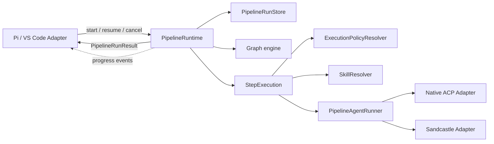

# Architecture cible — moteur pipeline ACP

## 1. Décision directrice

Le moteur pipeline doit devenir le Module qui possède entièrement le cycle de vie d’un run. Les hôtes Pi et VS Code ne doivent plus déduire l’état depuis une combinaison de chaînes retournées, événements et variables mutables.

Le Seam externe recommandé est une petite Interface de commandes qui retourne toujours un résultat discriminé.

```ts
export interface PipelineRuntime {
  start(input: StartPipelineInput): Promise<PipelineRunResult>;
  resume(input: ResumePipelineInput): Promise<PipelineRunResult>;
  cancel(sessionId: string): PipelineRunResult;
  inspect(sessionId: string): PipelineRunSnapshot | null;
}
```

Les événements restent utiles pour le streaming et la télémétrie, mais ne portent plus la vérité terminale du run.

## 2. Design It Twice

Trois Interfaces radicalement différentes ont été comparées.

### Option A — commandes retournant un résultat discriminé

```ts
type PipelineRunResult =
  | { kind: 'paused'; sessionId: string; pause: PipelinePause }
  | { kind: 'completed'; sessionId: string; output: string }
  | { kind: 'rejected'; sessionId: string; reason?: string }
  | { kind: 'cancelled'; sessionId: string }
  | { kind: 'failed'; sessionId: string; error: PipelineRunError };
```

**Interface** : quatre opérations, résultats explicites, erreurs métier structurées.

**Ce que l’Implementation cache** : registry, checkpointer LangGraph, compilation, reprise, step outputs, interruptions, annulation et nettoyage.

**Leverage** : élevé. Tous les hôtes utilisent la même machine à états sans la réimplémenter.

**Trade-off** : une migration des méthodes historiques `createPlan()` / `approvePlan()` est nécessaire.

### Option B — event stream comme Interface principale

```ts
interface PipelineRunStream {
  events: AsyncIterable<PipelineRunEvent>;
  send(command: PipelineRunCommand): Promise<void>;
}
```

**Interface** : adaptée aux UIs temps réel et à plusieurs consommateurs.

**Ce que l’Implementation cache** : la totalité du moteur, avec une communication bidirectionnelle.

**Leverage** : élevé pour une UI complexe, mais l’appelant doit encore réduire le stream pour connaître le dernier état.

**Trade-off** : plus de concepts, tests asynchrones plus lourds, surdimensionné pour le besoin actuel.

### Option C — objet session mutable

```ts
interface PipelineRunHandle {
  snapshot(): PipelineRunSnapshot;
  answer(text: string): Promise<void>;
  approve(): Promise<void>;
  reject(): void;
  cancel(): void;
}
```

**Interface** : familière et orientée objet.

**Ce que l’Implementation cache** : registre et cycle de vie derrière un handle.

**Leverage** : bon pour un run unique.

**Trade-off** : durée de vie et persistance du handle compliquées, risque d’état obsolète, moins naturel pour les hôtes qui identifient déjà les runs par `sessionId`.

## 3. Recommandation

Retenir l’option A.

Elle maximise la Depth avec peu d’opérations, conserve les événements pour le streaming et reste compatible avec les architectures actuelles de Pi et VS Code.



## 4. Interface de résultat

### 4.1 Résultat discriminé

```ts
export type PipelineRunResult =
  | PipelinePausedResult
  | PipelineCompletedResult
  | PipelineRejectedResult
  | PipelineCancelledResult
  | PipelineFailedResult;

export interface PipelinePausedResult {
  kind: 'paused';
  sessionId: string;
  pause: PipelinePause;
  snapshot: PipelineRunSnapshot;
}

export interface PipelineCompletedResult {
  kind: 'completed';
  sessionId: string;
  output: string;
  snapshot: PipelineRunSnapshot;
}

export interface PipelineRejectedResult {
  kind: 'rejected';
  sessionId: string;
  reason?: string;
  snapshot: PipelineRunSnapshot;
}

export interface PipelineCancelledResult {
  kind: 'cancelled';
  sessionId: string;
  snapshot?: PipelineRunSnapshot;
}

export interface PipelineFailedResult {
  kind: 'failed';
  sessionId: string;
  error: PipelineRunError;
  snapshot?: PipelineRunSnapshot;
}
```

### 4.2 Invariants

- Un appel retourne exactement un état stable : pause ou état terminal.
- `paused` implique que le run reste présent dans le store.
- `completed`, `rejected` et `cancelled` impliquent que les ressources actives sont libérées.
- Un Adapter hôte ne lit jamais un événement pour décider s’il doit conserver la session active.
- Les événements peuvent être perdus sans rendre le résultat de commande ambigu.

### 4.3 Erreurs

Les erreurs attendues deviennent des valeurs métier :

```ts
type PipelineRunErrorCode =
  | 'unknown_pipeline'
  | 'missing_agent'
  | 'invalid_resume'
  | 'malformed_output'
  | 'execution_failed'
  | 'policy_denied'
  | 'promotion_failed';
```

Les exceptions restent réservées aux erreurs de programmation ou d’infrastructure inattendues.

## 5. Pause générique

### 5.1 Interface

```ts
export interface PipelinePause {
  id: string;
  kind: 'approval' | 'question' | 'promotion';
  title?: string;
  content: string;
  contentType: 'markdown' | 'proposed_plan' | 'text';
  metadata?: Record<string, string | number | boolean>;
}

export type ResumeDecision =
  | { kind: 'approve'; content?: string }
  | { kind: 'answer'; content: string }
  | { kind: 'reject'; reason?: string };
```

### 5.2 DSL cible

Compatibilité minimale :

```yaml
- id: delivery_approval
  type: approval
  title: Approve specification and task plan
  contentType: markdown
  input: |
    ## Specification
    {{steps.spec.output}}

    ## Task plan
    {{steps.tasks.output}}
```

Le wrapper `<proposed_plan>` n’est nécessaire que lorsque `contentType: proposed_plan` est explicitement demandé.

### 5.3 Placement du Seam

Le protocole LangGraph `interrupt()` reste un Seam interne. Le moteur traduit l’interruption en `PipelinePause`. Les hôtes ne connaissent ni `Command`, ni `MemorySaver`, ni `thread_id`.

## 6. État de run

### 6.1 Snapshot public

```ts
export interface PipelineRunSnapshot {
  sessionId: string;
  pipelineId: string;
  status: 'running' | 'paused' | 'completed' | 'rejected' | 'cancelled' | 'failed';
  currentStepId?: string;
  pause?: PipelinePause;
  outputs: Record<string, PipelineStepOutputValue>;
  startedAt: string;
  updatedAt: string;
}
```

Le snapshot est une projection stable. Il ne contient pas le graphe compilé, l’AbortController ou les objets LangGraph.

### 6.2 Store

```ts
export interface PipelineRunStore {
  load(sessionId: string): PipelineRunRecord | null;
  save(record: PipelineRunRecord): void;
  delete(sessionId: string): void;
  listActive(): PipelineRunRecord[];
}
```

Dépendance actuelle : **in-process**. Un `MemoryPipelineRunStore` suffit dans un premier temps.

Un second Adapter persistant ne doit être ajouté que lorsqu’une reprise après redémarrage est réellement livrée. À ce moment, un `FilePipelineRunStore` rendra le Seam externe justifié.

## 7. Politique d’exécution

### 7.1 Problème d’Interface

`sideEffects` et `permissions` sont aujourd’hui deux valeurs indépendantes. Les appelants doivent connaître leur interaction et les Adapters les interprètent différemment.

Le Module cible reçoit une intention et produit une politique exécutoire.

```ts
export interface ExecutionPolicy {
  filesystem: 'read-only' | 'workspace-write';
  terminal: 'deny' | 'ask' | 'allow';
  network: 'deny' | 'ask' | 'allow';
  promotion: 'discard' | 'ask' | 'auto-apply' | 'auto-reject';
}

export interface ExecutionPolicyResolver {
  resolve(input: {
    primitive: PipelinePrimitiveDefinition;
    transport: PipelineTransportCapabilities;
    approvals: PipelineApprovalContext;
  }): ExecutionPolicy;
}
```

### 7.2 Adapters

**Native ACP Adapter** :

- refuse `writeTextFile` en read-only ;
- refuse ou demande confirmation pour les terminaux selon la politique ;
- journalise les refus avec un code stable ;
- ne dépend pas du prompt pour faire respecter la règle.

**Sandcastle Adapter** :

- autorise l’écriture dans le worktree isolé ;
- rejette le worktree pour une politique read-only ;
- applique la politique de promotion pour workspace-write.

Deux Adapters existent : le Seam est réel.

### 7.3 Capacités

```ts
export interface PipelineTransportCapabilities {
  isolatedFilesystem: boolean;
  enforceReadOnlyFilesystem: boolean;
  supportsPromotion: boolean;
  supportsTerminalPolicy: boolean;
}
```

Le moteur valide la politique avant l’exécution et échoue avec `policy_denied` si l’Adapter ne peut pas garantir le contrat.

## 8. Résolution des skills

### 8.1 Interface

```ts
export interface SkillResolver {
  resolveExplicit(request: {
    workspaceCwd: string;
    names: string[];
  }): ResolvedSkillSet;

  discoverModelInvocable(request: {
    workspaceCwd: string;
  }): ResolvedSkillSet;
}
```

### 8.2 Invariants

- `disable-model-invocation` ne s’applique qu’à `discoverModelInvocable`.
- `resolveExplicit` inclut un skill demandé même s’il est non invocable automatiquement.
- Un nom explicitement demandé mais absent produit une erreur de validation ou d’exécution claire.
- La composition du prompt est centralisée dans le Module, pas dupliquée dans chaque runner.

## 9. Rôles et phases

Deux choix sont acceptables.

### Choix recommandé — métadonnées explicites optionnelles

```yaml
primitives:
  task_planner:
    agent: Pi Agent
    role: planner
    phase: planning
```

```ts
interface PipelinePrimitiveDefinition {
  role?: string;
  phase?: PipelineStatus;
}
```

Fallback de compatibilité : conserver temporairement les heuristiques actuelles, mais émettre un warning quand elles sont utilisées.

### Choix alternatif — supprimer la sémantique de rôle du moteur

Le moteur émet seulement `stepId`, `primitiveId` et un statut générique. Chaque hôte choisit son libellé.

Cette option réduit l’Interface, mais elle diminue la cohérence Pi / VS Code. Les métadonnées explicites sont donc préférables.

## 10. Adapter hôte Pi

Le contrôleur devient un Module de présentation fin.

```ts
const result = await runtime.resume({
  sessionId,
  decision: { kind: 'approve', content: approvedContent },
});

switch (result.kind) {
  case 'paused':
    keepHeartbeat(result.sessionId);
    showPause(result.pause);
    break;
  case 'completed':
    finishHeartbeat(result.sessionId);
    showCompleted(result.output);
    break;
  case 'rejected':
  case 'cancelled':
  case 'failed':
    finishHeartbeat(result.sessionId);
    showTerminalResult(result);
    break;
}
```

Le Module ne possède plus de `pendingPlan` comme source de vérité ; il peut conserver uniquement un cache de présentation dérivé du snapshot.

## 11. Adapter hôte VS Code

`VirtualSessionRuntime.sendPrompt()` peut continuer à retourner un `PromptResponse` pour `SessionManager`, mais l’Implementation orchestration traduit le `PipelineRunResult` vers les messages ACP virtuels.

Le Seam `VirtualSessionRuntime` reste inchangé dans la première migration. Le moteur commun est corrigé avant toute évolution vers plusieurs runtimes virtuels.

## 12. Surface de test cible

Les tests principaux traversent l’Interface `PipelineRuntime` :

1. start → paused ;
2. resume → paused sur une seconde approval ;
3. resume → completed ;
4. cancel pendant chaque phase ;
5. reject à chaque pause ;
6. erreur d’agent ;
7. policy denied ;
8. skill explicite non invocable automatiquement ;
9. branches parallèles read-only ;
10. parité des Adapters Pi et VS Code sur les résultats.

Les tests des Modules internes restent ciblés sur les algorithmes complexes, mais ne remplacent pas les tests à l’Interface externe.

## 13. Résultat attendu

L’architecture cible concentre la complexité dans trois Modules profonds :

- `PipelineRuntime` : cycle de vie, pauses et résultats ;
- `ExecutionPolicyResolver` : traduction des intentions en garanties ;
- `SkillResolver` : sélection, validation et injection.

Les Adapters hôtes et transports deviennent plus petits, plus prévisibles et testables par contrat.