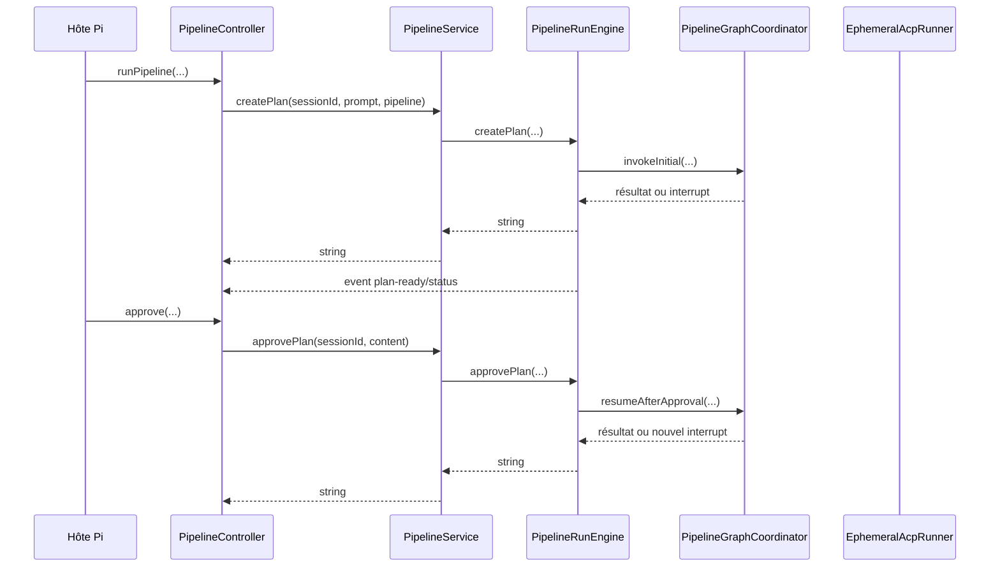
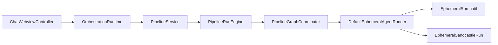

# 1. Architecture actuelle

## 1.1 Vue monorepo

Le `package.json` racine déclare quatre workspaces :

| Workspace | Rôle architectural |
| --- | --- |
| `acp-pipeline` | Module partagé : types, validation, compilation LangGraph, registre des runs, exécution et événements. |
| `acp-sandcastle` | Module partagé d’isolation et de bridge Sandcastle. |
| `plugin-vscode` | Adapter VS Code : configuration, sessions interactives, webview, transport natif/Sandcastle/virtual. |
| `plugin-pi` | Adapter Pi : commandes `/pipeline`, outil `run_pipeline`, connexion ACP, UI Pi et promotion Sandcastle. |

La documentation racine décrit encore trois workspaces et omet `acp-sandcastle`. C’est un écart documentaire, pas un problème de runtime, mais il indique que la carte d’architecture doit être tenue depuis le manifeste réel.

## 1.2 Flux de commande actuel

### Pi



Le moteur peut renvoyer un nouvel interrupt après une reprise. Cependant, le type de retour reste `Promise<string>`. `PipelineController` doit donc inférer si le string représente une pause ou une fin en observant `pendingPlan`, modifié par l’événement `plan-ready`.

`runPipeline()` contient déjà cette inférence. `approve()` ne la contient pas : il annonce toujours la fin, efface `activeSessionId` et arrête le heartbeat.

### VS Code



`OrchestrationRuntime.approve()` attend `PipelineService.approvePlan()` puis termine le tour UI. Il ne supprime pas lui-même la session, donc le défaut visible est moins sévère que dans Pi. L’interface reste néanmoins ambiguë : l’adapter ne sait pas, via la valeur retournée, si une nouvelle pause a été atteinte.

## 1.3 Modules du package partagé

### `PipelineGraphCompiler`

**Interface** : compiler un `PipelineDefinition` en graphe invocable.

**Implémentation cachée** :

- nœuds agents ;
- nœuds parallèles ;
- nœuds `approval` basés sur `interrupt()` ;
- rendu des templates ;
- fusion des sorties ;
- reprise via `Command`.

Le module est déjà profond. Le défaut est dans le modèle d’interrupt : le payload est `{ stepId, plan }`, même quand le contenu n’est pas un plan.

### `PipelineGraphCoordinator`

**Interface** : compiler, invoquer, reprendre et interpréter le résultat du graphe.

Il détecte l’interrupt avec `readApprovalInterrupt()`, valide systématiquement un bloc `<proposed_plan>`, place l’état dans `pendingApproval` et émet `plan-ready`.

Le module concentre correctement la lecture du résultat LangGraph. Le prochain approfondissement consiste à faire retourner un `PipelineRunOutcome` au lieu d’un string.

### `PipelineRunEngine`

**Interface actuelle** :

```ts
createPlan(...): Promise<string>
approvePlan(...): Promise<string>
rejectPlan(...): void
cancel(...): void
```

**Implémentation cachée** : registre, checkpointer, compilation, exécution, révision du plan, annulation, erreurs et événements.

Le module est profond dans son implémentation, mais son interface perd l’information la plus importante : l’état terminal ou suspendu du run.

### `PipelineService`

`PipelineService` construit un `PipelineRunEngine`, retransmet trois événements et délègue cinq méthodes. Selon le deletion test, sa suppression ne ferait presque disparaître aucune complexité : les appels réapparaîtraient directement vers `PipelineRunEngine`.

Il est donc actuellement shallow. Deux options cohérentes existent :

- le supprimer de l’interface publique ;
- ou l’approfondir pour en faire le vrai module public `PipelineRuntime`, avec résultats de commande, snapshots et invariants de lifecycle.

La seconde option est recommandée pour préserver un point d’entrée stable aux deux hôtes.

## 1.4 État du run et pause

`PipelineRunRegistry` stocke :

- le graphe compilé ;
- `pendingApproval: { stepId, plan } | null` ;
- un `AbortController` ;
- le plan approuvé ;
- les sorties par étape.

Le registre sait donc déjà si le run est suspendu. Cette information reste cachée derrière une interface qui retourne seulement du texte.

L’état réel est :

```text
running → paused → running → paused → running → completed
```

L’interface publique laisse entendre :

```text
create plan → approve plan → completed
```

La PR #9 expose cette divergence.

## 1.5 Effets de bord et permissions

Le DSL porte deux concepts :

```ts
sideEffects: "none" | "workspace"
permissions: "ask" | "allowAll"
```

Ils ne représentent pas la même chose :

- `sideEffects` est une promesse sur les capacités de l’étape ;
- `permissions` est une stratégie de réponse aux demandes de permission émises par l’agent.

### Adapter Pi natif

`PipelineExecutor` transmet les deux valeurs à `EphemeralAcpRunner`. L’adapter natif :

- initialise toujours ACP avec `writeTextFile: true` et `terminal: true` ;
- crée toujours `FileSystemHandler` et `TerminalHandler` ;
- transforme `permissions: allowAll` en auto-approbation.

`sideEffects: none` n’est pas utilisé par le connector natif. La promesse « read-only » n’est donc pas exécutoire.

### Adapter Pi Sandcastle

Après le run :

- `sideEffects !== workspace` déclenche `sandcastle/reject` ;
- `sideEffects === workspace` passe par preview puis promotion.

L’isolation rend ici la promesse exécutoire : les éventuelles mutations sont confinées puis rejetées.

### Adapter VS Code

`DefaultEphemeralAgentRunner` retire `sideEffects` avant d’appeler le run natif. Le chemin natif ne l’applique donc pas non plus. Le chemin Sandcastle applique la promotion via `SandcastlePromotion`.

## 1.6 Skills

Les deux hôtes ont deux implémentations différentes.

### Pi

`renderSkillsCatalog()` reçoit une allow-list explicite issue de la primitive, mais exclut quand même les entrées `disable-model-invocation: true`.

Cela confond :

1. **découverte automatique** par le modèle ;
2. **invocation explicite** par le pipeline.

### VS Code

`PipelineExecutor` transmet `skills`, mais `DefaultEphemeralAgentRunner` et `EphemeralRun` n’en font pas une propriété de leur interface. `EphemeralRun` appelle `buildPromptWithSkills()` sans allow-list et injecte le catalogue général découvrable.

Les sémantiques Pi et VS Code ne sont donc pas alignées :

- Pi filtre explicitement mais trop fortement ;
- VS Code ignore la sélection de la primitive.

## 1.7 Événements et commandes

Les événements `status`, `plan-ready` et `session-update` sont utiles pour :

- timeline UI ;
- streaming ;
- debug ;
- observabilité.

Ils ne doivent pas devenir une seconde source de vérité du lifecycle. Aujourd’hui, Pi utilise `plan-ready` pour modifier `pendingPlan` et `activeSessionId`, puis inspecte cet état après la commande. Cela introduit un couplage temporel entre :

- résultat de commande ;
- ordre d’émission des événements ;
- état mutable du contrôleur.

La correction doit séparer :

- **commande** → résultat autoritatif ;
- **événement** → projection et observation.
