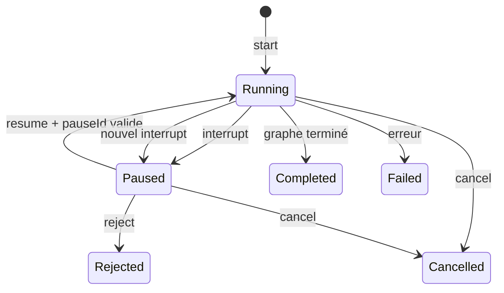
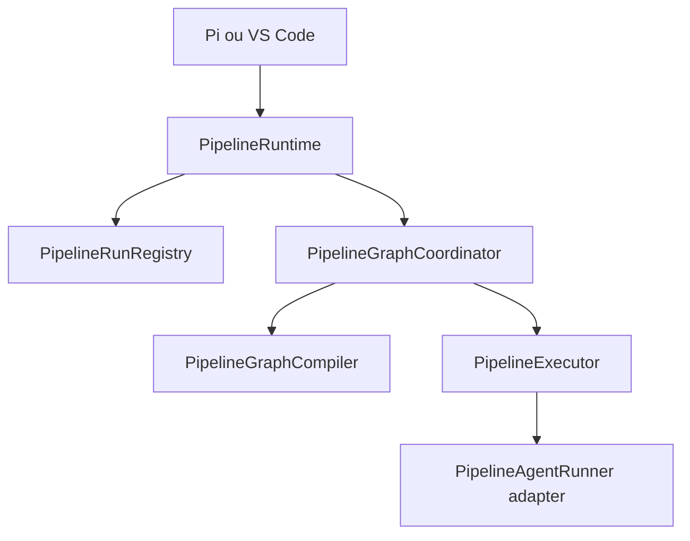

# 4. Architecture cible recommandée

## 4.1 Principes

1. Le résultat d’une commande est la source de vérité du lifecycle.
2. Les événements servent à la projection, au streaming et au debug.
3. Une pause est un concept générique du pipeline, pas un plan encodé en XML.
4. Une capacité déclarée doit être exécutée par l’adapter ou refusée.
5. Une skill explicitement sélectionnée n’est pas une skill auto-invoquée.
6. Pi et VS Code consomment la même interface publique et les mêmes tests de contrat.

## 4.2 Types publics proposés

```ts
export type PipelineRunPhase =
  | "running"
  | "paused"
  | "completed"
  | "rejected"
  | "cancelled"
  | "failed";

export interface PipelinePause {
  pauseId: string;
  stepId: string;
  kind: "approval";
  purpose: "plan" | "delivery" | "generic";
  content: string;
  contentType: "proposed_plan" | "markdown";
  editable: boolean;
}

export type PipelineRunOutcome =
  | {
      kind: "paused";
      sessionId: string;
      pause: PipelinePause;
    }
  | {
      kind: "completed";
      sessionId: string;
      output: string;
    };

export interface PipelineResumeInput {
  sessionId: string;
  pauseId: string;
  decision: "approve";
  content?: string;
}

export interface PipelineRunSnapshot {
  sessionId: string;
  pipelineId: string;
  phase: PipelineRunPhase;
  currentStepId?: string;
  pause?: PipelinePause;
}
```

`reject` reste une commande séparée pour garder une interface lisible. Une future unification en `decision: reject` reste possible.

## 4.3 Évolution du DSL

Étape actuelle :

```yaml
- id: delivery_approval
  type: approval
  input: |
    <proposed_plan>
    ... contenu markdown ...
    </proposed_plan>
```

Étape cible :

```yaml
- id: delivery_approval
  type: approval
  purpose: delivery
  contentType: markdown
  editable: false
  input: |
    ## Specification
    {{steps.spec.output}}

    ## Task plan
    {{steps.tasks.output}}
```

Valeurs par défaut compatibles :

- `purpose: plan` si `contentType: proposed_plan` ;
- `purpose: generic` sinon ;
- `editable: true` pour un plan, `false` autrement.

Le validateur ne doit appliquer `assertSingleProposedPlan` qu’aux contenus `contentType: proposed_plan`.

## 4.4 Transition de run



Le registre n’est supprimé que pour `Completed`, `Rejected`, `Cancelled` et `Failed`.

## 4.5 `PipelineRuntime` public et modules internes



### Interface externe

```ts
interface PipelineRuntime {
  start(input: PipelineStartInput): Promise<PipelineRunOutcome>;
  resume(input: PipelineResumeInput): Promise<PipelineRunOutcome>;
  reject(input: PipelineRejectInput): void;
  cancel(sessionId: string): void;
  getSnapshot(sessionId: string): PipelineRunSnapshot | undefined;
  on(event: "status" | "pause" | "session-update", listener: ...): this;
}
```

### Compatibilité transitoire

Pendant une version :

```ts
createPlan(...) // wrapper deprecated vers start(...)
approvePlan(...) // wrapper deprecated vers resume(...)
plan-ready // alias deprecated de pause
PipelinePlanReadyEvent // alias deprecated de PipelinePauseEvent
```

Les wrappers doivent retourner le nouveau outcome. Il ne faut pas conserver un wrapper `Promise<string>` qui recréerait l’ambiguïté.

## 4.6 Adapter Pi

`PipelineController` conserve :

- parsing des commandes ;
- contexte UI Pi ;
- heartbeat ;
- buffers de streaming ;
- présentation des événements ;
- dialogue de promotion.

Il ne conserve plus `pendingPlan` comme source de vérité. Il peut conserver un `activeSnapshot` pour l’affichage, mais le met à jour depuis l’outcome.

Pseudo-code :

```ts
private applyOutcome(outcome: PipelineRunOutcome): PipelineRunCommandResult {
  if (outcome.kind === "paused") {
    this.activeSessionId = outcome.sessionId;
    this.activePause = outcome.pause;
    this.stopHeartbeat();
    return { sessionId: outcome.sessionId, pause: outcome.pause, awaitingApproval: true };
  }

  this.flushSessionStreamBuffers(outcome.sessionId);
  this.activeSessionId = null;
  this.activePause = null;
  this.stopHeartbeat();
  this.showCompleted(outcome.output);
  return { sessionId: outcome.sessionId, output: outcome.output, awaitingApproval: false };
}
```

L’événement `pause` affiche le contenu, mais ne décide pas si la commande est terminée.

## 4.7 Adapter VS Code

`OrchestrationRuntime.sendPrompt()` et `approve()` consomment l’outcome.

- outcome `paused` : terminer le tour de streaming sans annoncer completion ; le bloc de pause est déjà projeté par événement ;
- outcome `completed` : terminer le tour et toucher l’historique ;
- `pauseId` doit voyager dans le message webview `approvePipelinePause` ;
- la webview ne doit plus poster seulement le texte du plan.

Le transport virtual reste le seam correct. Aucune logique LangGraph ne doit entrer dans `SessionManager` ou la webview.

## 4.8 Capacités exécutoires

### Contrat proposé

```ts
export interface PipelineStepCapabilities {
  workspace: "read-only" | "read-write";
  terminal: "disabled" | "enabled";
  permissionMode: "ask" | "allow-all";
  isolation: "native" | "discarded-sandbox" | "promotable-sandbox";
}
```

Mapping v2 transitoire :

| DSL actuel | Capacités dérivées |
| --- | --- |
| `sideEffects: none`, agent natif | `read-only`, terminal `disabled`, native |
| `sideEffects: none`, Sandcastle | sandbox jetable, modifications rejetées |
| `sideEffects: workspace`, Sandcastle | sandbox promotable |
| `sideEffects: workspace`, natif | read-write natif, seulement après pause approuvée |

### Enforcement Pi natif

`ConnectionManager` construit le client selon la politique :

- `clientCapabilities.fs.writeTextFile = false` en read-only ;
- `clientCapabilities.terminal = false` si terminal désactivé ;
- `PiAcpClient.writeTextFile()` refuse également l’appel, même si un agent ignore les capabilities ;
- aucun `TerminalHandler` permissif ne doit être exposé en read-only ;
- `allow-all` ne peut jamais dépasser les capacités du step.

### Limite importante

Il n’existe pas de classification fiable et portable d’une commande terminal « lecture seule ». Un agent qui a accès au terminal peut exécuter une commande mutante. Le mode natif strict doit donc désactiver le terminal. Un reviewer nécessitant `git diff`, tests ou grep via shell doit être exécuté dans une sandbox jetable, ou utiliser des outils de lecture dédiés.

## 4.9 Skills explicites

```ts
export type SkillSelection =
  | { mode: "none" }
  | { mode: "discoverable" }
  | { mode: "explicit"; names: string[] };
```

Règles :

- `disable-model-invocation: true` exclut seulement `discoverable` ;
- `explicit` peut résoudre cette skill ;
- une skill explicitement demandée mais absente produit une erreur de catalogue, pas un silence ;
- l’ordre déclaré dans le pipeline est conservé ;
- Pi et VS Code injectent la même sélection.

Pour les pipelines, `skills: [...]` devient toujours `mode: explicit`.

## 4.10 Événements

Événement cible :

```ts
interface PipelinePauseEvent {
  sessionId: string;
  pause: PipelinePause;
  role?: string;
  agentName?: string;
  revised?: boolean;
}
```

Les événements `status` et `session-update` restent inchangés autant que possible.

Le statut `awaiting_approval` peut être conservé pour la timeline, mais la présence d’une pause dans l’outcome/snapshot est l’information de contrôle.
