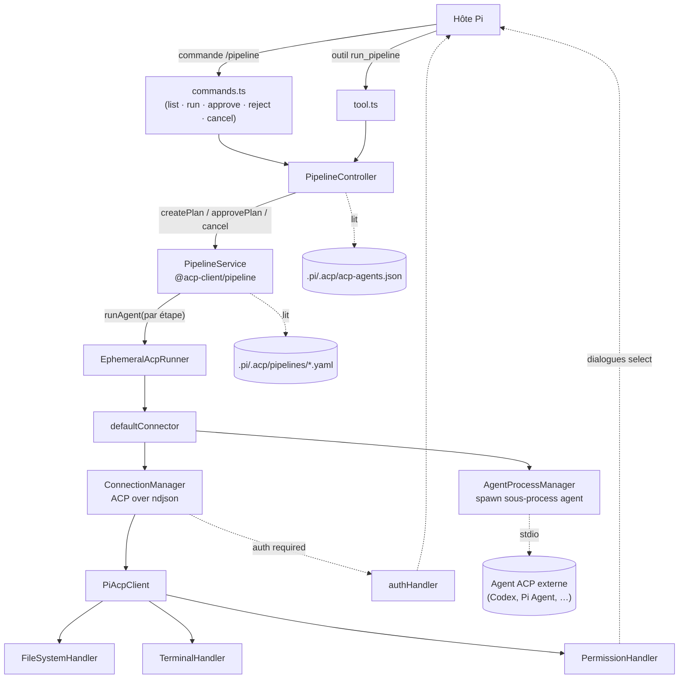
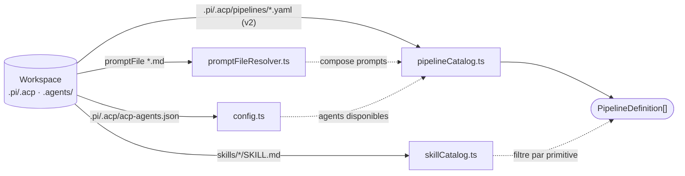
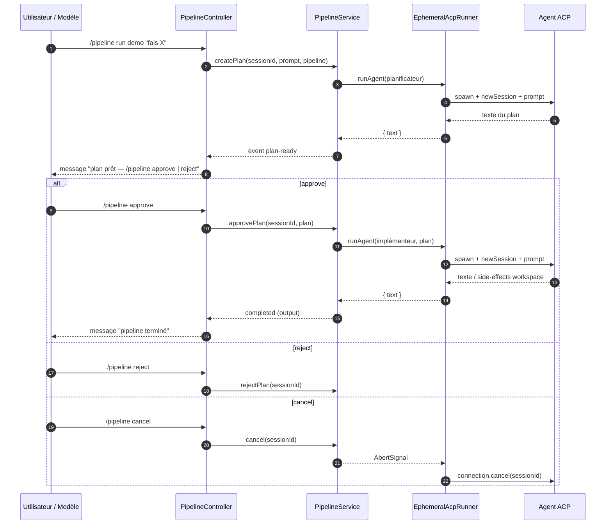
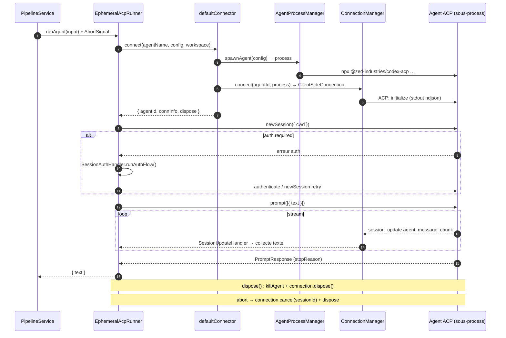

# @acp-client/pi-extension

Extension Pi pour les pipelines ACP. Ce plugin orchestre plusieurs agents ACP externes via des définitions de pipeline déclaratives.

## Ce que ça fait concrètement

- Lit `.pi/.acp/acp-agents.json` pour charger les agents ACP configurés (agents natifs lancés en ligne de commande)
- Découvre les **pipelines** dans `.pi/.acp/pipelines/*.yaml` (étapes d'agents séquentielles avec validation humaine)
- Spawn les processus d'agents ACP, se connecte via le SDK ACP, proxy les appels fichiers/terminal/permissions, et gère l'authentification
- Expose une commande `/pipeline` dans Pi (`list`, `run`, `approve`, `reject`, `cancel`)
- Enregistre un outil `run_pipeline` pour que le modèle Pi puisse lancer des pipelines tout seul

## Prérequis

- Node.js >= 22.19.0
- npm (livré avec Node)
- L'hôte Pi (`@earendil-works/pi-coding-agent`) — le plugin est chargé par Pi, il tourne pas en standalone

## Installation

Le plugin s'installe avec l'hôte Pi. Dans ton workspace, il te faut un fichier `.pi/.acp/acp-agents.json` et au moins un pipeline YAML dans `.pi/.acp/pipelines/`.

### 1. Configurer les agents ACP

Crée le fichier `.pi/.acp/acp-agents.json` :

```json
{
  "agents": {
    "Codex CLI": {
      "command": "npx",
      "args": ["@zed-industries/codex-acp@latest"],
      "env": {},
      "displayName": "Codex"
    },
    "Pi Agent": {
      "command": "pi-acp",
      "args": [],
      "env": {}
    }
  },
  "pipeline": {
    "enabled": true,
    "instructionsMaxBytes": 262144
  }
}
```

| Champ | Description |
| --- | --- |
| `agents.<nom>.command` | Exécutable ou commande shell pour lancer l'agent |
| `agents.<nom>.args` | Arguments CLI (optionnel) |
| `agents.<nom>.env` | Variables d'environnement supplémentaires (optionnel) |
| `agents.<nom>.displayName` | Label affiché dans l'UI (optionnel) |
| `agents.<nom>.skills` | `false` désactive l'injection de skills pour cet agent (optionnel) |
| `pipeline.enabled` | Active ou désactive la découverte des pipelines (défaut `true`) |
| `pipeline.instructionsMaxBytes` | Taille max des fichiers `promptFile` chargés par les pipelines (défaut 256 Ko) |

### 2. Définir des pipelines (`.pi/.acp/pipelines/`)

Fichiers YAML version 2 dans `.pi/.acp/pipelines/`. Exemple `demo.yaml` :

```yaml
version: 2
id: demo
title: Pipeline démo
primitives:
  planificateur:
    agent: Codex CLI
    skills:
      - codebase-design
    prompt: |
      Fais un plan pour cette demande :
      {{userPrompt}}
    output: proposed_plan
    sideEffects: none
  implémenteur:
    agent: Pi Agent
    skills:
      - tdd
    prompt: |
      Implémente :
      {{steps.approbation.output}}
    output: markdown
    sideEffects: workspace
steps:
  - id: planificateur
    use: planificateur
  - id: approbation
    type: approval
    input: "{{steps.planificateur.output}}"
  - id: implémenteur
    use: implémenteur
```

Chaque pipeline déclare des **primitives** (appels d'agents paramétrés avec des prompts template) et des **étapes** qui les enchaînent. Les étapes de type `approval` font une pause pour validation humaine avant de continuer.

Le plugin fournit aussi un exemple de workflow asynchrone dans `plugin-pi/.acp/pipelines/async-use-case-review.yaml`. Il teste le pattern :

```text
cadrage -> analyses produit + technique en parallele -> synthese
```

Les branches paralleles sont volontairement en `sideEffects: none` : elles peuvent analyser et proposer, puis une étape de synthèse réconcilie leurs sorties via `{{steps.investigation.branches.<branche>.output}}`.

Les primitives peuvent aussi utiliser `promptFile` pour externaliser les instructions longues :

```yaml
primitives:
  planificateur:
    agent: Codex CLI
    promptFile: .pi/.acp/agents/planner.md
    prompt: |
      Demande utilisateur :
      {{userPrompt}}
    output: proposed_plan
    sideEffects: none
```

Quand `promptFile` et `prompt` sont tous les deux présents, le contenu du fichier est ajouté avant le prompt inline.

### 3. Utiliser des skills par primitive

Les skills se déclarent sur chaque primitive avec `skills: [...]`. Le runner injecte uniquement les skills demandées pour l'étape en cours, depuis `.agents/skills/<name>/SKILL.md`.

```yaml
primitives:
  verifier:
    agent: Codex CLI
    skills:
      - unit-tests
    prompt: |
      Vérifie l'implémentation :
      {{steps.implement.output}}
    output: markdown
    sideEffects: none
```

Si `skills` est absent, aucun catalogue de skills n'est injecté. Si l'agent a `"skills": false` dans `.pi/.acp/acp-agents.json`, l'injection est désactivée pour cet agent.

## Build

```bash
cd plugin-pi
npm install
npm run build
```

Compile le TypeScript de `src/` vers `dist/`. Le build est obligatoire avant de lancer les tests.

## Tests

```bash
npm test
```

Ça build puis lance le test runner natif de Node :

```
npm run build && node --test "dist/test/**/*.test.js"
```

### Fichiers de test

| Fichier | Ce qui est testé |
| --- | --- |
| `test/configCatalog.test.ts` | Parsing de la config, validation des YAML de pipeline, résolution des `promptFile`, limite de taille, catalogue de skills |
| `test/runnerController.test.ts` | Runner ACP mocké (collecte de texte, annulation/abort), commandes `/pipeline` (`list`, `run` → `approve`) |
| `test/helpers.ts` | Création de workspaces temporaires, écriture de fixtures (configs, pipelines, skills) |

Zero dépendance externe pour les tests — que du `node:test` et `node:assert`.

## Organisation du code

```
src/
├── index.ts                  Point d'entrée du plugin, se branche sur l'ExtensionAPI de Pi
├── types.ts                  Types partagés (PiAcpConfig, Logger, NativeAcpAgentConfig, etc.)
│
├── catalog/                  Découverte de la configuration et des définitions
│   ├── config.ts             Charge et parse .pi/.acp/acp-agents.json
│   ├── pipelineCatalog.ts    Charge et valide .pi/.acp/pipelines/*.yaml
│   ├── promptFileResolver.ts Résout et compose les fichiers promptFile des pipelines
│   └── skillCatalog.ts       Charge et filtre le catalogue .agents/skills
│
├── runtime/                  Couche d'intégration avec l'hôte Pi
│   ├── commands.ts           Commande slash /pipeline (list, run, approve, reject, cancel)
│   ├── pipelineController.ts Orchestrateur : connecte PipelineService, EphemeralAcpRunner, UI approve/reject
│   └── tool.ts               Enregistre l'outil run_pipeline pour invocation par le modèle
│
├── acp/                      Implémentation du protocole ACP (spawn, connexion, proxy)
│   ├── agentProcess.ts       Spawn les processus d'agents ACP (cross-platform)
│   ├── connectionManager.ts  Établit la ClientSideConnection ACP, initialise le protocole
│   ├── defaultConnector.ts   Assemble AgentProcessManager + ConnectionManager en une interface Connector unique
│   ├── ephemeralRunner.ts    Runner principal : connect → authenticate → prompt → collecte texte, avec abort/cancel
│   ├── piAcpClient.ts        Implémentation du Client ACP, délègue aux handlers fichiers/terminal/permissions
│   ├── authHandler.ts        Détecte les erreurs d'auth required et lance le flow d'auth interactif
│   ├── fileSystemHandler.ts  Proxy read/write TextFile avec validation du chemin dans le workspace
│   ├── terminalHandler.ts    Gère le cycle de vie des terminaux (create, output, wait, kill, release)
│   ├── permissionHandler.ts  Délègue les demandes de permission aux dialogues select de l'UI Pi
│   ├── security.ts           Prévention de traversal de chemin et filtrage de variables d'environnement
│   ├── sessionUpdateHandler.ts Pub/sub pour les notifications de session ACP (agent_message_chunk, etc.)
│   └── runAbortedError.ts    Erreur sentinelle pour les runs annulés/abandonnés
│
└── types/
    └── external.d.ts         Déclarations de types pour js-yaml, typebox et @earendil-works/pi-coding-agent
```

### Flux d'architecture



### Découverte de la configuration (catalog)



### Exécution d'un pipeline (avec validation humaine)



### Cycle de vie d'un run ACP (EphemeralAcpRunner)



### Dépendances clés

| Package | Rôle |
| --- | --- |
| `@acp-client/pipeline` | Moteur d'orchestration de pipelines (définitions, service, validation, exécution) |
| `@agentclientprotocol/sdk` | Protocole ACP (Agent Client Protocol) |
| `@earendil-works/pi-coding-agent` | ExtensionAPI de l'hôte Pi (commandes, outils, UI) |
| `js-yaml` | Parsing YAML pour pipelines |
| `typebox` | Schéma runtime pour validation des paramètres d'outils |
