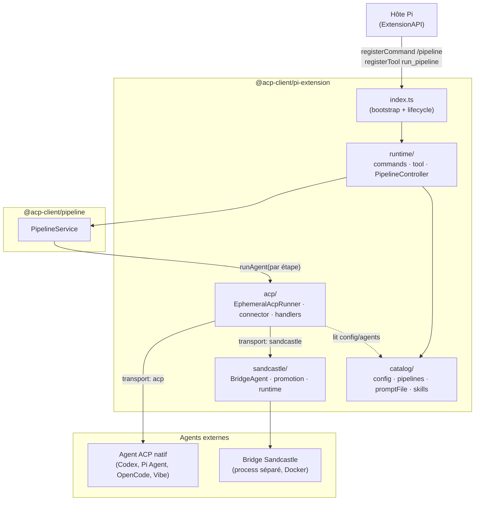
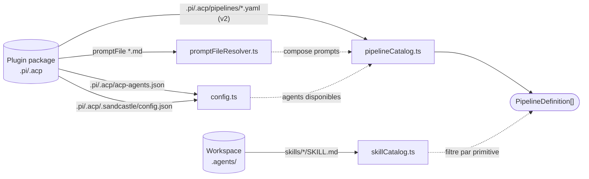
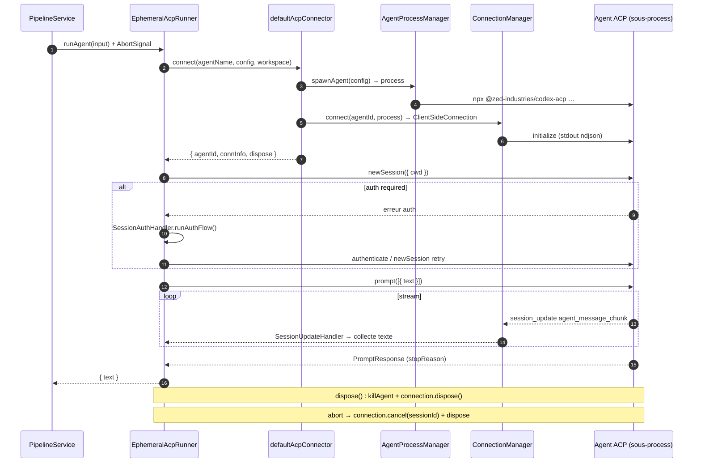
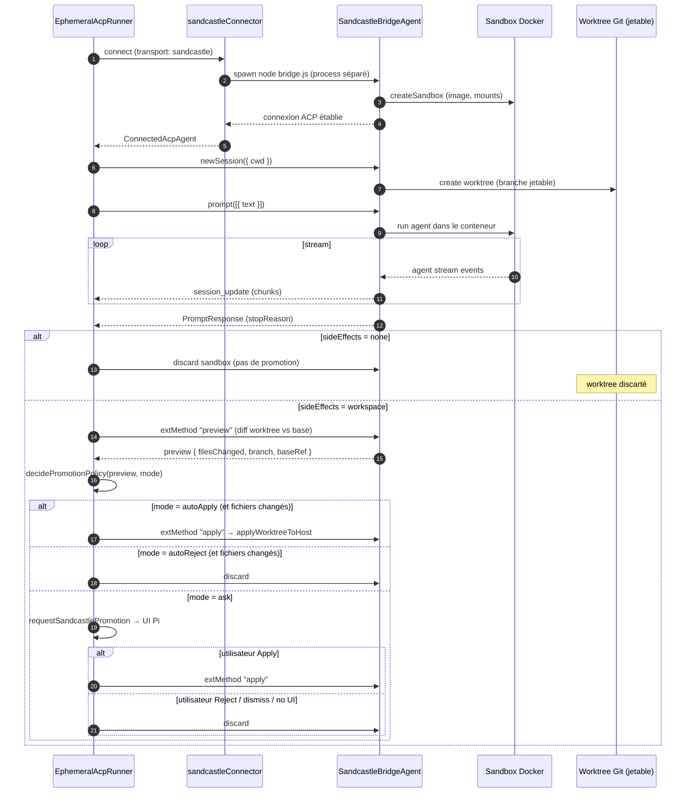

# Architecture de `@acp-client/pi-extension`

> Document d'architecture du plugin `plugin-pi` (package `@acp-client/pi-extension`).
> Il décrit l'**état courant du code**, pas une spec idéalisée ni une feuille de route.
> Source de vérité : `src/`, `README.md`, `CONTEXT.md`, `adr/`, `plans/corrections-architecture.md`.

---

## 1. Résumé

`plugin-pi` est une **extension** (plugin) pour l'hôte d'agent **Pi**
(`@earendil-works/pi-coding-agent`). Sa mission : exposer à Pi l'exécution de
**pipelines ACP déclaratifs** — des enchaînements d'appels à des agents ACP
externes (Codex CLI, Pi Agent, OpenCode, Vibe…), avec approbation humaine,
exécutés soit via le transport ACP natif, soit via le transport *Sandcastle*
(Docker + worktree Git jetable).

L'architecture tient sur trois invariants :

- **Run éphémère** : un run d'agent = un process bridge ACP né et mort pour ce
  run, sans session persistante réutilisée.
- **Autonomie vis-à-vis de `plugin-vscode`** : `plugin-pi` et `plugin-vscode`
  sont des implémentations sœurs et divergentes. La duplication de code est
  intentionnelle (ADR-0008) ; aucun ne dépend de l'autre.
- **Un seul module profond partagé** : `@acp-client/pipeline` — le moteur de
  pipelines (`PipelineService`, définitions, statuts, approbation). C'est la
  seule frontière commune aux deux plugins. Tout le reste vit et diverge dans
  chaque plugin.

`plugin-pi` joue le rôle d'**adapter** Pi ↔ ACP : il branche le moteur de
pipelines sur l'`ExtensionAPI` de Pi (commandes, outil, UI, permissions) et sur
le SDK ACP (`@agentclientprotocol/sdk`).

---

## 2. Vocabulaire canonique

Repris de [`CONTEXT.md`](../CONTEXT.md). À respecter mot pour mot ; la colonne
« à éviter » liste les termes ambigus ou concurrents.

| Terme | Définition | À éviter |
| --- | --- | --- |
| **Sandcastle** | Mode d'exécution d'un agent dans Docker et un worktree Git jetable, exposé comme un transport ACP (`sandcastle`) distinct du transport natif (`acp`). | sandbox (seul), agent docker, mode conteneur |
| **Run éphémère** | Un run d'agent = un process bridge ACP né et mort pour ce run, sans session persistante réutilisée. | run longue durée, session réutilisable, connected agent |
| **Side effects** | Propriété d'un *run* précisant ce qu'il peut faire : `none` (lecture seule) ou `workspace` (écriture dans le worktree, promotable). Ce n'est **pas** une propriété de l'agent. | permissions, droits, capabilities |
| **Promotion** | Décision d'appliquer les changements du worktree isolé dans le vrai workspace (`applied`), de les jeter (`rejected`), ou de ne pas décider (`cancelled`). | merge, commit, sync |
| **Cancelled** | Outcome de promotion quand il n'y a pas eu de décision explicite. Distinction conservée avec `rejected` : `rejected` = décision explicite de jeter, `cancelled` = pas de décision. | rejeté (ambigu), abandonné |

---

## 3. Frontières et dépendances

### Couches internes

| Couche | Chemin | Rôle | Dépend de |
| --- | --- | --- | --- |
| **Bootstrap** | `src/index.ts` | Point d'entrée exporté par défaut. Enregistre la commande `/pipeline` et l'outil `run_pipeline`, gère le cycle de vie `session_start`/`session_shutdown`, maintient un `PipelineController` par `cwd`. | `runtime/*`, `types.ts` |
| **Runtime** | `src/runtime/` | Intégration avec l'hôte Pi : commande slash, outil, orchestrateur (`PipelineController`). Connecte l'UI Pi ↔ `PipelineService` ↔ runner. | `@earendil-works/pi-coding-agent`, `@acp-client/pipeline`, `acp/`, `catalog/` |
| **ACP** | `src/acp/` | Implémentation du protocole ACP côté client : spawn des agents, connexion ACP over ndjson, handlers fichier/terminal/permissions, run éphémère, abort. Le runner (`EphemeralAcpRunner`) route selon `config.transport`. | `@agentclientprotocol/sdk`, `@acp-client/pipeline`, `sandcastle/`, `catalog/` |
| **Sandcastle** | `src/sandcastle/` | Transport alternatif : runtime Docker + worktree Git jetable, `BridgeAgent` (côté agent, process séparé), promotion, mounts. | `@ai-hero/sandcastle`, `@agentclientprotocol/sdk` |
| **Catalog** | `src/catalog/` | Découverte de la configuration : agents ACP, agents Sandcastle, pipelines YAML v2, `promptFile`, skills. | `js-yaml`, `@acp-client/pipeline`, `types.ts` |
| **Types** | `src/types.ts`, `src/types/external.d.ts` | Types partagés (`PiAcpConfig`, `Logger`, `PiAgentConfigEntry`…) et déclarations de types pour `js-yaml`, `typebox`, `@earendil-works/pi-coding-agent`. | — |

### Dépendances externes

| Package | Rôle |
| --- | --- |
| `@acp-client/pipeline` | Moteur d'orchestration des pipelines (`PipelineService`, définitions, statuts, approbation). **Module profond partagé** avec `plugin-vscode`. |
| `@agentclientprotocol/sdk` | Implémentation du protocole ACP (`ClientSideConnection`, `AgentSideConnection`, types de request/response/notification). |
| `@earendil-works/pi-coding-agent` | API de l'hôte Pi : `ExtensionAPI`, `ExtensionContext`, `registerCommand`, `registerTool`, `sendMessage`, dialogues `ui`. |
| `js-yaml` | Parsing YAML des pipelines. |
| `typebox` | Schéma runtime des paramètres de l'outil `run_pipeline`. |
| `@ai-hero/sandcastle` | Runtime Docker + worktree pour Sandcastle (`createSandbox`, providers `codex`/`cursor`/`pi`, sandbox `docker`). |

---

## 4. Schéma de couches global



Le flux dominant est descendant : l'hôte Pi appelle le bootstrap, qui route vers
le runtime, qui pilote le moteur de pipelines, qui à chaque étape appelle le
runner, qui choisit le transport. Les `catalog/` nourrissent l'orchestrateur en
config et en définitions — ils ne sont jamais sur le chemin d'exécution d'un
prompt agent.

---

## 5. Découverte de la configuration (`catalog/`)

La configuration est **embarquée dans le package du plugin**, pas dans le
workspace ouvert (ADR-0007). `src/catalog/pluginRoot.ts` résout la racine du
package installé, et les chargeurs lisent à partir de là.

### Ce qui est embarqué (depuis la racine du plugin)

| Fichier / motif | Chargé par | Produit |
| --- | --- | --- |
| `.pi/.acp/acp-agents.json` | `config.ts` → `loadPiAcpConfig` | `PiAcpConfig` (agents natifs + `pipeline.enabled`, `instructionsMaxBytes`, `timeouts`) |
| `.pi/.acp/.sandcastle/config.json` | `config.ts` → `loadSandcastleConfig` | `SandcastleConfig` (agents Sandcastle + `promotion`) |
| `.pi/.acp/pipelines/*.yaml` (version 2) | `pipelineCatalog.ts` | `PipelineDefinition[]` |
| `.pi/.acp/agents/*.md` | `promptFileResolver.ts` → `resolvePipelinePromptFiles` | Prompts composés (le `promptFile` est ajouté **avant** le `prompt` inline) |

### Ce qui est lu dans le workspace

| Fichier / motif | Chargé par | Produit |
| --- | --- | --- |
| `.agents/skills/<name>/SKILL.md` | `skillCatalog.ts` → `loadSkillCatalog` | `SkillCatalogEntry[]` (filtrées puis rendues par primitive via `renderSkillsCatalog`) |

### Assemblage (`loadPiAgentCatalog`)

`loadPiAgentCatalog(cwd)` fusionne natif + Sandcastle en un `PiAgentCatalog`.
Règles de validation notables (dans `config.ts`) :

- `acp-agents.json` est **natif-only** : une entrée avec
  `transport: "sandcastle"` y est rejetée, avec un message pointant vers le
  fichier dédié `.pi/.acp/.sandcastle/config.json`.
- Un même nom d'agent déclaré dans les deux fichiers est une erreur (l'entrée
  est supprimée du catalogue fusionné).
- Providers Sandcastle acceptés : `codex`, `cursor`, `pi`, `vibe`. Efforts :
  `low`/`medium`/`high`/`xhigh`. Promotion : `ask`/`autoApply`/`autoReject`.

### Limitation explicite (v1)

Les fichiers `<workspace>/.pi/.acp/...` ne sont **pas** lus comme surcharge en
v1 (ADR-0007). La surcharge workspace est reportée à une v2. Les skills font
exception : elles représentent les capacités du projet ouvert et restent chargées
depuis `<workspace>/.agents/skills/`.

### Découverte (catalog)



---

## 6. Runtime : la commande `/pipeline` et l'outil `run_pipeline`

### Surface utilisateur (enregistrée par `index.ts`)

- **Commande slash** `/pipeline` avec sous-commandes : `list`, `run`, `approve`,
  `reject`, `cancel`, `verbose on|off|status`, `status`. Complétion d'arguments
  fournie. Le routage se fait dans `src/runtime/commands.ts`
  (`handlePipelineCommand`) ; l'enregistrement alternatif existe dans
  `registerPipelineCommand` (voir §12, duplication connue).
- **Outil** `run_pipeline` (schéma `typebox`) : invoquable par le modèle Pi.
  Paramètres `pipelineName` (optionnel, défaut = premier pipeline) et `prompt`.
  Retourne soit « plan prêt — approbation en attente » soit « pipeline terminé ».

### `PipelineController` — l'orchestrateur

`src/runtime/pipelineController.ts`. Il y en a **un par `cwd`** (un par
workspace), créé paresseusement et mis en cache dans `index.ts` (Map
`controllers: Map<string, PipelineController>`). Cycle de vie :

- `session_start` → `getController(ctx.cwd)` crée le contrôleur si absent.
- `session_shutdown` → `dispose()` de tous les contrôleurs, puis `clear()`.

Le constructeur câble le `PipelineService` (du package `@acp-client/pipeline`)
avec un `runner` basé sur `EphemeralAcpRunner`, et fournit au service des
**callbacks de dépendances** résolvant la config à la volée :

- `getAgentConfigs` → `loadPiAgentCatalog(cwd).agents`
- `getSandcastlePromotion` → mode de promotion global
- `requestSandcastlePromotion` → demande d'approbation UI
- `getPipelineDefinitions` / `getPipelineDefinitionForAgent`
- `isAgentSandcastle` (dérivé local)
- `getPermissionContext`, `isRunAbortedError`

Il s'abonne aux événements du service : `plan-ready`, `status`,
`session-update`. C'est lui qui bufferise/titre les chunks de stream, gère le
heartbeat d'activité, et envoie les `sendMessage` à l'UI Pi.

### Méthodes publiques de `PipelineController`

| Méthode | Rôle |
| --- | --- |
| `runPipeline(name, prompt, ctx?)` | Crée un plan via `service.createPlan`. Renvoie `{ sessionId, output, awaitingApproval }` ou `{ sessionId, plan, awaitingApproval: true }`. |
| `approve(ctx?, approvedPlan?)` | Reprend l'exécution via `service.approvePlan`. |
| `reject()` | `service.rejectPlan(sessionId)`. |
| `cancel()` | `service.cancel(sessionId)` → propage un `AbortSignal` au runner. |
| `listPipelines()` / `formatPipelineList()` | Liste les pipelines découverts. |
| `formatActivitySnapshot()` | Vue d'activité pour `/pipeline status`. |
| `setVerbose(bool)` / `isVerbose()` | Mode verbeux (chunks de stream affichés). |
| `dispose()` | Stoppe le heartbeat, libère les ressources. |

---

## 7. Cycle de vie d'un run ACP (transport natif)

Le cœur d'un run est `EphemeralAcpRunner.runAgent` (`src/acp/ephemeralRunner.ts`).
Pour chaque étape du pipeline, le `PipelineService` appelle `runAgent` avec un
`PipelineAgentRunInput` (prompt, agent, `sideEffects`, `signal: AbortSignal`).

### Séquence

Le README contient déjà cette séquence ; elle est reprise/résumée ici.



### Pièces clés (`src/acp/`)

| Fichier | Rôle |
| --- | --- |
| `ephemeralRunner.ts` | `EphemeralAcpRunner`. Route selon `config.transport` (`acp` → `defaultAcpConnector`, `sandcastle` → `sandcastleConnector`). Compose le prompt (skills + promptFile + inline). Gère abort/timeout via `operationGuards`. |
| `defaultConnector.ts` | `defaultAcpConnector` assemble `AgentProcessManager` + `ConnectionManager`, retourne `ConnectedAcpAgent` (`{ agentId, connInfo, dispose }`). |
| `agentProcess.ts` | `AgentProcessManager` — spawn cross-platform du sous-process agent. |
| `connectionManager.ts` | Établit la `ClientSideConnection` ACP, initialise le protocole (ndjson over stdio). |
| `sessionUpdateHandler.ts` | Pub/sub des notifications `session_update` (collecte du texte, chunks). |
| `authHandler.ts` | Détecte « auth required », lance le flow d'auth interactif via l'UI Pi, retry `newSession`. |
| `operationGuards.ts` | `withTimeout`, `withProcessGuard` — bornent chaque opération (initialize, newSession, prompt, permission, auth UI, promotion UI). |

### Abort et dispose

`runAgent` enregistre un listener `abort` sur le signal : il appelle
`connection.cancel({ sessionId })` puis `dispose()`. Le `dispose` est idempotent.
L'erreur sentinelle `RunAbortedError` (`runAbortedError.ts`) marque les runs
annulés ; `PipelineController` la reconnaît via `isRunAbortedError`.

---

## 8. Handlers ACP côté Pi

`PiAcpClient` (`src/acp/piAcpClient.ts`) est une classe fine qui **délègue**
chaque méthode du protocole ACP à un handler spécialisé :

| Méthode ACP | Handler | Note |
| --- | --- | --- |
| `readTextFile`, `writeTextFile` | `fileSystemHandler.ts` (`FileSystemHandler`) | Valide que le chemin reste dans le workspace (via `validatePath`). |
| `createTerminal`, `terminalOutput`, `waitForTerminalExit`, `killTerminal`, `releaseTerminal` | `terminalHandler.ts` (`TerminalHandler`) | Gère le cycle de vie des terminaux ; output borné par `outputByteLimit`. |
| `requestPermission` | `permissionHandler.ts` (`PermissionHandler`) | Délègue aux dialogues `select` de l'UI Pi. |
| `sessionUpdate` | `sessionUpdateHandler.ts` (`SessionUpdateHandler`) | Pub/sub des notifications vers `EphemeralAcpRunner` et le contrôleur. |

### `security.ts`

- `validatePath(filePath, workspaceRoot)` — prévention de **path traversal** :
  résout le chemin, vérifie qu'il reste dans la racine du workspace, puis
  revalide via `realpathSync` sur l'ancêtre existant (détecte les symlinks qui
  s'échappent). Lance `Error("Path escapes workspace boundary: …")` sinon.
- `filterEnv(agentEnv)` — retire une **deny-list** de variables d'environnement
  sensibles (`PATH`, `LD_PRELOAD`, `LD_LIBRARY_PATH`, `DYLD_*`, `NODE_OPTIONS`,
  `NODE_PATH`, `ELECTRON_RUN_AS_NODE`) avant de les passer au sous-process.

### Risque de sécurité connu (à corriger, voir §12)

> ⚠️ **État courant, pas vérité figée.** `TerminalHandler.createTerminal`
> exécute `spawn(params.command, params.args ?? [], { shell: true })`
> (`src/acp/terminalHandler.ts:50-55`). Les paramètres proviennent d'un agent
> ACP **externe** ; l'interface « command + args » avec `shell: true` permet
> l'interpolation shell et déclenche un avertissement de sécurité Node pendant
> les tests. Ce point est documenté comme risque ouvert dans
> [`plans/corrections-architecture.md`](../plans/corrections-architecture.md)
> (étape 1, priorité haute) et n'est **pas** encore corrigé. Un document
> d'architecture reflète, ne corrige pas.

---

## 9. Sandcastle : transport alternatif

### Pourquoi un second transport

Le transport `sandcastle` exécute l'agent dans **Docker + un worktree Git
jetable** :

- isolation forte (chaque run a son propre worktree),
- les changements ne touchent jamais le vrai workspace tant qu'ils ne sont pas
  **promus**,
- la promotion est contrôlée par l'utilisateur via le même canal que
  l'approbation du pipeline.

C'est un transport **distinct et éphémère** : on ne porte pas la couche « agent
longue durée » de `plugin-vscode` (`SandcastleAcpAgent`, `BridgeConversation`,
`PromptHistory`). On ne porte que le minimum : `BridgeConfig`, garde
Docker/worktree, `WorktreePromotion`, `PromotionPolicy`, et `bridge.ts` lancé
en process séparé (ADR-0009).

### Ce qui change côté runner

`EphemeralAcpRunner` route selon `config.transport` :

- `acp` → `defaultAcpConnector` (§7).
- `sandcastle` → `sandcastleConnector` (`src/acp/sandcastleConnector.ts`).

`sandcastleConnector` spawn `node dist/.../bridge.js --provider --model --effort`
(avec `ACP_SANDCASTLE_IMAGE`), puis réutilise `ConnectionManager.connect` — le
**bridge parle ACP**, donc tout le reste du runner (session, prompt, abort) est
inchangé.

### Côté host (`src/sandcastle/`)

| Fichier | Rôle |
| --- | --- |
| `DefaultSandcastleRuntime.ts` | `defaultSandcastleRuntime` : fournit `createSandbox`, `createProvider` (factory de providers `codex`/`pi`/`vibe`/`cursor`), `createSandboxProvider` (sandbox `docker` + mounts). Provider `vibe` = CLI programmatique `vibe -p --output streaming --trust`. |
| `BridgeConfig.ts` | Config passée au bridge (provider, model, effort, image, env). |
| `SandboxMounts.ts` | `buildSandboxMounts` — montages de volumes Docker (worktree, homes). |
| `BridgeAgent.ts` | `SandcastleBridgeAgent` — côté **agent** (process séparé) : `initialize`, `newSession` (crée worktree), `prompt` (run dans le sandbox + stream), `extMethod` (preview/apply de la promotion), `cancel`, `dispose`. |
| `bridge.ts` | Point d'entrée du process bridge (stringifié/spawné). |
| `runGit.ts` | `runGit()` — exécution de commandes Git sur le worktree. |

### Cycle de vie Sandcastle (absent du README)



### Distinction `sideEffects: none` vs `workspace`

Portée par l'input du run (`PipelineAgentRunInput`), **pas par la config agent**
(ADR-0009). La promotion ne se déclenche que pour `sideEffects: workspace`.
Avec `none`, la sandbox est simplement discartée à la fin du run.

---

## 10. Promotion et worktree

### `PromotionPolicy.ts`

`decidePromotionPolicy(preview, mode)` retourne une décision parmi :

| Décision | Condition |
| --- | --- |
| `discard_no_changes` | `preview.filesChanged === 0` |
| `auto_apply` | `mode === 'autoApply'` |
| `auto_reject` | `mode === 'autoReject'` |
| `prompt` | `mode === 'ask'` (et fichiers changés) |

### `WorktreePromotion.ts`

- `previewWorktreeChanges(worktreePath, baseRef, branch)` → `PromotionPreview`
  (diff du worktree vs base : fichiers, branche, base).
- `applyWorktreeToHost(hostCwd, preview)` → `ApplyToHostResult` — applique les
  changements du worktree au vrai workspace. Appelée via `extMethod` côté
  `BridgeAgent`.

### Outcomes et sémantique

Aligné sur `CONTEXT.md`. Les outcomes de promotion sont
`'applied' | 'no_changes' | 'rejected' | 'cancelled'` :

| Outcome | Sens |
| --- | --- |
| `applied` | Changements appliqués au workspace (décision explicite Apply, ou `autoApply`). |
| `no_changes` | Aucun fichier modifié dans la sandbox ; discarded sans décision. |
| `rejected` | Décision **explicite** de jeter les changements (Reject, ou `autoReject`). |
| `cancelled` | **Pas de décision** : humain dismiss l'approbation, ou UI Pi absente (headless). La sandbox est discartée mais la distinction avec `rejected` est conservée. |

En mode `ask` **sans UI Pi** (pipeline headless), le run s'arrête proprement sur
`cancelled` sans crash (ADR-0009). En mode `ask` **avec UI**, la promotion
**réutilise le canal d'approbation du pipeline** (ADR-0005) : `approve` ≈ Apply,
`reject` ≈ Reject, dismiss ≈ `cancelled`. Pas de « View Diff » interactif en v1.

---

## 11. Décisions structurelles clés (ADR résumés)

Synthèses courtes ; voir les ADR complets dans [`adr/`](../adr/).

### ADR-0007 — Configuration Pi embarquée en v1

Le runtime lit `.pi/.acp/` depuis la **racine du package plugin**, pas depuis le
workspace. Un workspace vide peut utiliser les pipelines fournis sans créer de
fichiers `.pi/.acp`. La surcharge workspace est reportée à une v2 ; les
`promptFile` commençant par `.pi/.acp/` sont résolus depuis la racine du plugin.
→ [`adr/0007-configuration-embarquee-v1.md`](../adr/0007-configuration-embarquee-v1.md)

### ADR-0008 — `plugin-pi` autonome, indépendant de `plugin-vscode`

`plugin-pi` est une implémentation **autonome** : on porte le code utile depuis
`plugin-vscode` en le **dupliquant**, sans factoriser la couche plugin. La
duplication est **intentionnelle**, pas une dette. La seule frontière commune
reste `@acp-client/pipeline`. Chaque plugin évolue à son rythme (pi est
éphémère, vscode est longue durée). → [`adr/0008-plugin-pi-autonome.md`](../adr/0008-plugin-pi-autonome.md)

### ADR-0009 — Sandcastle éphémère sous `.pi/.acp/.sandcastle`

Décisions corrélées difficiles à défaire : (1) runtime éphémère — on ne porte que
`BridgeConfig`, garde Docker/worktree, `WorktreePromotion`, `PromotionPolicy`,
`bridge.ts` ; (2) config séparée embarquée sous
`plugin-pi/.pi/.acp/.sandcastle/config.json` (top-level `promotion` + agents
Sandcastle-only) ; (3) `sideEffects` est une propriété du **run**, pas de l'agent ;
(4) `EphemeralAcpRunner` route selon `config.transport`, `sandcastleConnector`
spawn `bridge.js` parlant ACP ; (5) outcomes `'applied' | 'no_changes' |
'rejected' | 'cancelled'`, réutilisation du canal d'approbation ADR-0005 ; (6)
`isAgentSandcastle` branché par one-liner dans les deps du `PipelineService`.
→ [`adr/0009-sandcastle-ephemere-sous-pi.md`](../adr/0009-sandcastle-ephemere-sous-pi.md)

### Autres ADR (contribuant à la forme actuelle)

- [`0001-configuration-runtime-sous-pi`](../adr/0001-configuration-runtime-sous-pi.md) — configuration runtime sous Pi.
- [`0002-pipeline-catalogue-canonique`](../adr/0002-pipeline-catalogue-canonique.md) — `@acp-client/pipeline` comme catalogue canonique.
- [`0003-skills-par-primitive-pipeline`](../adr/0003-skills-par-primitive-pipeline.md) — skills injectés par primitive.
- [`0004-selection-pipeline-par-id-court`](../adr/0004-selection-pipeline-par-id-court.md) — sélection par `id` ou `title`.
- [`0005-pipeline-avec-approbation-humaine`](../adr/0005-pipeline-avec-approbation-humaine.md) — étapes `approval` (canal réutilisé pour Sandcastle).
- [`0006-annulation-runner-abortsignal`](../adr/0006-annulation-runner-abortsignal.md) — annulation via `AbortSignal`.

---

## 12. Limites et dette connues

Reprise honnête de [`plans/corrections-architecture.md`](../plans/corrections-architecture.md).
Présenté comme **état courant**, pas comme feuille de route (la roadmap vit
dans `ROADMAP.md`).

1. **Sécurité du seam process/terminal (priorité haute).**
   `TerminalHandler.createTerminal` utilise `spawn(command, args, { shell: true })`
   avec des paramètres issus d'un agent ACP externe (`src/acp/terminalHandler.ts:50`).
   L'interface « command + args » n'empêche pas l'interpolation shell. Node
   émet un avertissement de sécurité pendant les tests. Correction envisagée :
   `shell: false` + validation que `command` est un binaire résolu, ou une
   interface séparée « shell command string » avec permission renforcée.

2. **Fuite de surface Sandcastle/teams côté Pi.**
   `plugin-pi` rejette Sandcastle dans `acp-agents.json`
   (`src/catalog/config.ts:202`), mais `@acp-client/pipeline` expose encore
   `isAgentSandcastle`, `getTeamPipelineForAgent`, `readWorkspaceDiff` et des
   méthodes team dans `PipelineService`. Cela élargit l'interface pour Pi sans
   leverage. Correction envisagée : interface minimale `PipelineServiceDependencies`
   pour les pipelines purs + facade séparée pour les teams/Sandcastle (consommée
   uniquement par `plugin-vscode`).

3. **`index.ts` devrait déléguer vers les modules runtime.**
   `index.ts` réimplémente l'enregistrement de `/pipeline` et `run_pipeline`
   alors que `src/runtime/commands.ts` (`registerPipelineCommand`) et
   `src/runtime/tool.ts` existent déjà. Duplication d'enregistrement.

4. **Surface publique exportée trop large.**
   `index.ts` réexporte beaucoup d'implémentation interne (runner, catalogues,
   controller, helpers). Sans consommateur bibliothèque, coût de maintenance
   élevé. Envisagé : limiter les exports publics au plugin par défaut + quelques
   types stables.

5. **Bootstrap des pipelines (templates vs runtime).**
   Le runtime lit `.pi/.acp/pipelines`. Des exemples vivent aussi sous
   `plugin-pi/.acp/pipelines` (hors `.pi/`). Manque un seam clair de
   bootstrap/copie. La roadmap mentionnait les teams comme « réalisées » alors
   que les tests vérifient qu'elles sont ignorées côté Pi.

---

## 13. Tests

Les tests vivent dans [`test/`](../test). **Zéro dépendance externe** : uniquement
`node:test` et `node:assert`.

| Fichier | Ce qui est couvert |
| --- | --- |
| `test/configCatalog.test.ts` | Parsing de la config (`loadPiAcpConfig`, `loadSandcastleConfig`), validation des YAML de pipeline, résolution des `promptFile`, limite `instructionsMaxBytes`, catalogue de skills, rejets (transport illégal, doublons de noms, providers invalides). |
| `test/runnerController.test.ts` | Runner ACP **mocké** (collecte de texte, annulation/abort), commandes `/pipeline` (`list`, `run` → `approve`), `PipelineController` avec `EphemeralAcpRunner` substitué. |
| `test/acpHandlers.test.ts` | Handlers ACP : filesystem (path traversal), terminal, permission, session update. |
| `test/sandcastle.test.ts` | Promotion, `decidePromotionPolicy`, `WorktreePromotion`. |
| `test/helpers.ts` | Fixtures : création de workspaces temporaires, écriture de configs/pipelines/skills. |

### Lancer les tests

```bash
npm test
```

= `npm run build && node --test "dist/test/**/*.test.js"`.

Le build est obligatoire avant les tests : `npm run build` compile `src/` vers
`dist/`, et les tests tournent sur `dist/test/*.js`.

---

## 14. Pour aller plus loin

- [`README.md`](../README.md) — guide utilisateur : prérequis, configuration
  embarquée, pipelines, skills, build, tests (ce document ne duplique pas ça).
- [`adr/`](../adr/) — décisions structurelles (0001 → 0009).
- [`ROADMAP.md`](../ROADMAP.md) — direction et évolutions prévues.
- [`CONTEXT.md`](../CONTEXT.md) — glossaire vivant (vocabulaire canonique, cette
  page reprend et respecte ses définitions).

---

### Notes de maintenance de ce document

- Ce document reflète l'**état courant du code** au moment de l'écriture. Quand
  une ADR est ajoutée ou qu'un point de `plans/corrections-architecture.md` est
  corrigé, mettre à jour §11/§12 en conséquence.
- Le vocabulaire de §2 provient de `CONTEXT.md` ; si `CONTEXT.md` change, ce
  tableau doit suivre.
- Les chemins de fichiers cités sont relatifs à la racine du plugin et
  existaient à l'écriture (vérifiés).
