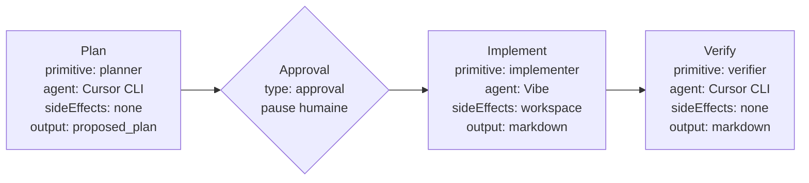
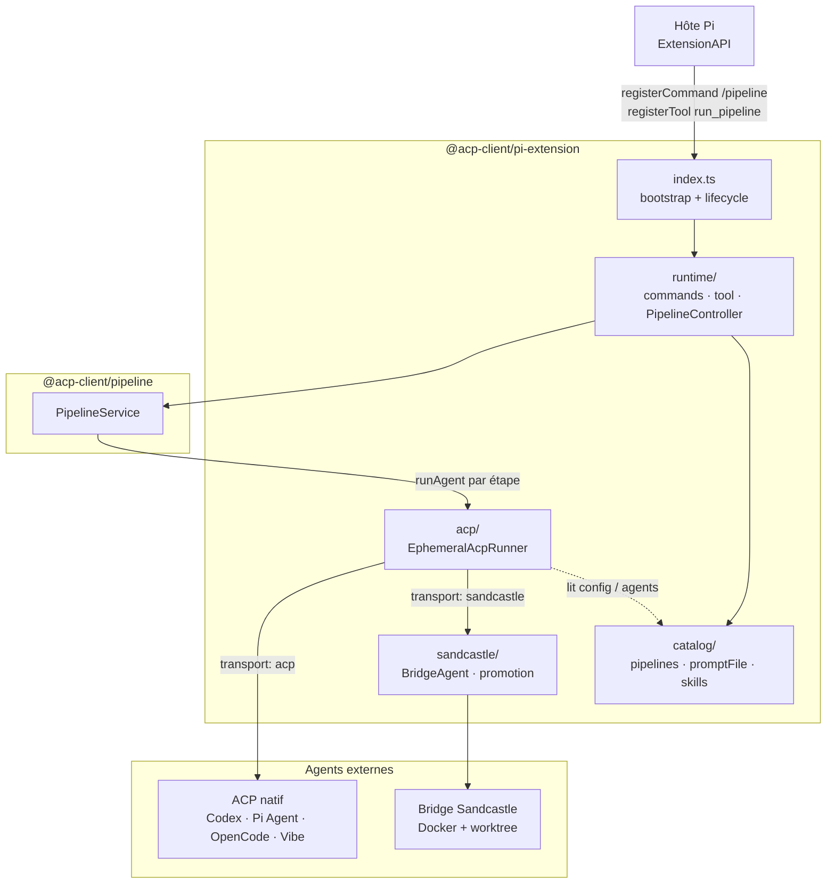
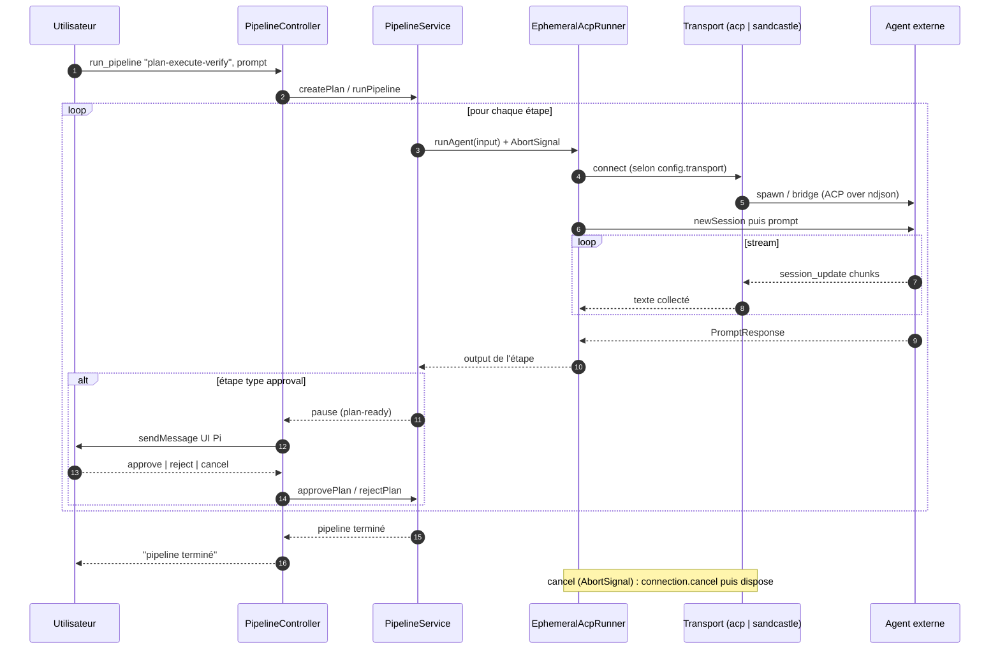
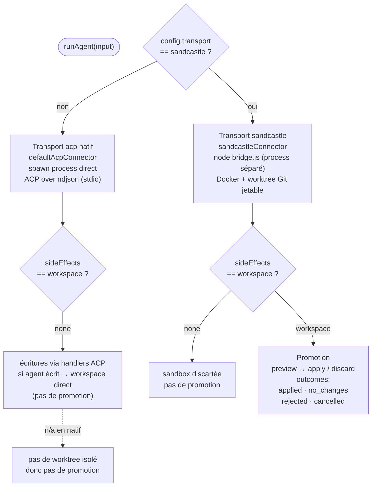
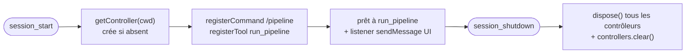

# Plan → Exécuter → Vérifier : architecture de `plugin-pi`

> **Ce document** est un *explainer* pédagogique qui suit le fil d'exécution
> d'une demande utilisateur réelle à travers le pipeline `plan-execute-verify`.
> Il est **complémentaire** de [`docs/architecture.md`](./architecture.md) : là
> où ce dernier décrit le code couche par couche, ici on suit le **chemin
> parcouru par un run**, du `plan` jusqu'au `verify`.
>
> **Audience** : personne entrant sur le projet, à l'aise avec TypeScript et
> Docker, mais découvrant ACP et Pi.
>
> **Sources de vérité** : `src/`, [`README.md`](../README.md),
> [`CONTEXT.md`](../CONTEXT.md), [`.acp/pipelines/plan-execute-verify.yaml`](../.acp/pipelines/plan-execute-verify.yaml),
> [`adr/`](../adr/). Ce document reflète l'état courant du code — il ne
> s'engage pas sur une v2 livrée.

---

## 1. Le projet en 3 lignes

`plugin-pi` (package `@acp-client/pi-extension`) est une extension de l'hôte
d'agent **Pi**. Il expose à Pi l'exécution de **pipelines ACP déclaratifs** :
des enchaînements d'appels à des agents externes (Codex CLI, Vibe…), ponctués
d'approbation humaine. Chaque étape tourne soit via le transport ACP natif
(`acp`), soit via le transport **Sandcastle** (`sandcastle` : Docker + worktree
Git jetable).

---

## 2. Le fil rouge : le pipeline `plan-execute-verify`

Le pipeline livré par défaut [`.acp/pipelines/plan-execute-verify.yaml`](../.acp/pipelines/plan-execute-verify.yaml)
définit **trois primitives** (`planner`, `implementer`, `verifier`) assemblées en
**quatre étapes**, dont une d'approbation :

| Étape | Primitive / type | Agent | `sideEffects` | `output` | Rôle |
| --- | --- | --- | --- | --- | --- |
| `plan` | `planner` | Cursor CLI | `none` | `proposed_plan` | Produire un plan « decision-complete ». |
| `approval` | `type: approval` | — (humain) | — | bloqué tant que pas de décision | L'UI Pi demande à l'humain d'approuver le plan. |
| `implement` | `implementer` | Vibe | `workspace` | `markdown` | Mettre en œuvre le plan approuvé dans le workspace. |
| `verify` | `verifier` | Cursor CLI | `none` | `markdown` | Vérifier que le plan approuvé a été réalisé. |

### Point central : `sideEffects` est une propriété du *run*, pas de l'agent

C'est l'invariant le plus subtil du projet (voir [`CONTEXT.md`](../CONTEXT.md) et
ADR-0009). `planner` et `verifier` sont en `none` (lecture / analyse) tandis que
`implementer` est en `workspace` (écriture promotable). Ce n'est **pas** une
aptitude attachée à l'agent : le même agent pourrait très bien lire dans un
pipeline et écrire dans un autre. La valeur (`none` `|` `workspace`) vit dans le
YAML de la primitive, et c'est elle — **pas une config agent** — qui décide
notamment si une promotion Sandcastle se déclenche.

---

## 3. Vue d'ensemble de l'architecture

Quand un pipeline tourne, l'appel descend à travers les couches suivantes. Le
détail couche par couche est dans [`docs/architecture.md`](./architecture.md) §3
et §4 ; on ne reprend ici que ce qui est utile pour suivre un run.

L'architecture tient sur **trois invariants** ([`docs/architecture.md`](./architecture.md) §1) :

1. **Run éphémère** : un run d'agent = un process bridge ACP né et mort pour ce
   run, sans session persistante réutilisée.
2. **Autonomie vis-à-vis de `plugin-vscode`** : `plugin-pi` et `plugin-vscode`
   sont des implémentations sœurs et divergentes. La duplication est
   **intentionnelle** (ADR-0008) ; aucun ne dépend de l'autre.
3. **Un seul module profond partagé** : `@acp-client/pipeline`
   (`PipelineService`, définitions, statuts, approbation). C'est la seule
   frontière commune aux deux plugins.

---

## 4. Que se passe-t-il à chaque étape

On suit la demande utilisateur : « corriger le bug X ». À chaque étape, on
distingue **côté orchestrateur** (le code de `plugin-pi`) et **côté agent**
(l'agent externe).

### 4.1 Plan — `planner`, Cursor CLI, `sideEffects: none`

- **Côté orchestrateur** : `PipelineService` appelle `runAgent` avec un
  `PipelineAgentRunInput`. `EphemeralAcpRunner` route vers le transport
  `acp` → `defaultAcpConnector`, spawn `@zed-industries/codex-acp…`
  (sous-process), ouvre une `ClientSideConnection` ACP over ndjson, fait
  `newSession({ cwd })` puis `prompt([{ text }])`. Le `prompt` est composé :
  skills + `promptFile` (prépendu) + `prompt` inline.
- **Côté agent** : Cursor CLI **lit** le workspace, ne modifie rien
  (`sideEffects: none`), et renvoie un bloc `<proposed_plan>…</proposed_plan>`.
- L'output (`proposed_plan`) est stocké comme `steps.plan.output` et exposé à
  l'étape d'approbation.

### 4.2 Approval — `type: approval`, pause humaine

- **Pas d'agent** : `type: approval` n'est pas une primitive, c'est une
  **étape d'approbation** du pipeline. Le `PipelineService` suspend le run ;
  `PipelineController` envoie un `sendMessage` à l'UI Pi pour demander à
  l'humain (`approve` `|` `reject` `|` `cancel`).
- L'utilisateur voit le plan proposé et décide. Les steps suivants reçoivent
  l'output de l'approbation via `{{steps.approval.output}}`.
- ⚠️ **Ne pas confondre** avec la **promotion Sandcastle** (§5) : l'approbation
  d'étape porte sur le *plan*, la promotion porte sur les *changements du
  worktree*. C'est le même canal UI qui est réutilisé (ADR-0005), mais les
  deux mécanismes sont distincts.

### 4.3 Implement — `implementer`, Vibe, `sideEffects: workspace`

- **Côté orchestrateur** : même mécanisme que le `plan`, mais avec un autre
  agent (Vibe) et surtout `sideEffects: workspace`. Le `prompt` embarque le
  `userPrompt` et `{{steps.approval.output}}` (le plan approuvé).
- **Côté agent** : Vibe **écrit** dans le worktree (ou directement le workspace
  en transport natif). En transport `sandcastle`, ces écritures sont isolées
  dans un worktree Git jetable et ne touchent le vrai workspace qu'après
  **promotion** (§5). En transport `acp` natif, l'agent écrit via les handlers
  ACP `readTextFile` / `writeTextFile` de `plugin-pi` (validés contre la
  racine du workspace, voir [`docs/architecture.md`](./architecture.md) §8).

### 4.4 Verify — `verifier`, Cursor CLI, `sideEffects: none`

- **Côté orchestrateur** : `runAgent` avec `verifier`. Le `prompt` reçoit
  `{{steps.approval.output}}` **et** `{{steps.implement.output}}` — l'agent
  vérifie donc le plan approuvé contre le résultat réel de l'implémentation.
- **Côté agent** : Cursor CLI **lit** (fichiers modifiés, tests, restes,
  risques) et produit un récap markdown sans écrire.

### Séquence temporelle d'un run

L'annulation est portée par un `AbortSignal` propagé jusqu'au runner
(ADR-0006) : le listener `abort` appelle `connection.cancel({ sessionId })` puis
`dispose()` (idempotent). L'erreur sentinelle `RunAbortedError` est reconnue par
`PipelineController`.

---

## 5. Les deux transports : `acp` natif vs `sandcastle`

`EphemeralAcpRunner` route selon `config.transport`. Le choix se fait par agent,
lors de chaque `runAgent`.

| | `acp` natif | `sandcastle` |
| --- | --- | --- |
| Isolation | under-process dans le workspace courant | Docker + worktree Git jetable |
| Changements | écrits via handlers ACP `plugin-pi` | isolés dans le worktree |
| Promotion | **n'existe pas** (pas de worktree) | `ask` \| `autoApply` \| `autoReject` |
| Outcomes | — | `applied` · `no_changes` · `rejected` · `cancelled` |

### Promotion (uniquement Sandcastle, uniquement `workspace`)

La promotion ne se déclenche **que** pour `sideEffects: workspace` en transport
`sandcastle`. `decidePromotionPolicy(preview, mode)` décide :

- `discard_no_changes` si aucun fichier modifié,
- `auto_apply` si `mode === 'autoApply'`,
- `auto_reject` si `mode === 'autoReject'`,
- `prompt` si `mode === 'ask'` (et fichiers changés).

Les **outcomes** finaux sont alignés sur [`CONTEXT.md`](../CONTEXT.md) :

- `applied` — changements appliqués au workspace (Apply explicite, ou `autoApply`),
- `no_changes` — rien n'a été modifié dans la sandbox,
- `rejected` — décision **explicite** de jeter (Reject, ou `autoReject`),
- `cancelled` — **pas de décision** (humain dismiss l'approbation, ou UI Pi
  absente / headless). La sandbox est discartée mais la distinction avec
  `rejected` est conservée (ADR-0009).

---

## 6. Le cycle de vie d'un plugin sous Pi

`plugin-pi` s'enregistre auprès de l'hôte Pi via `src/index.ts`. Il n'y a **pas
de session globale mutable** : un `PipelineController` est créé **par `cwd`**
(une session Pi = un workspace), mis en cache dans une `Map`, et disposé à
l'arrêt.

L'UI exposée : commande slash `/pipeline` (`list`, `run`, `approve`, `reject`,
`cancel`, `verbose`, `status`) et outil `run_pipeline` invoquable par le modèle
Pi (paramètres `pipelineName` — optionnel, défaut = premier pipeline — et
`prompt`). Voir [`docs/architecture.md`](./architecture.md) §6 pour le détail.

---

## 7. Glossaire court

Reprise de [`CONTEXT.md`](../CONTEXT.md) ; définitions complètes dedans.

- **Sandcastle** — mode d'exécution dans Docker + worktree Git jetable, exposé
  comme transport ACP `sandcastle` distinct du transport natif `acp`.
- **Run éphémère** — un run d'agent = un process bridge ACP né et mort pour ce
  run, sans session persistante réutilisée.
- **Side effects** — propriété d'un *run* (`none` lecture seule, `workspace`
  écrite promotable), **pas** de l'agent.
- **Promotion** — décision d'appliquer les changements du worktree isolé dans le
  vrai workspace (`applied`), de les jeter (`rejected`), ou de ne pas décider
  (`cancelled`).
- **Cancelled** — outcome de promotion sans décision explicite (dismiss /
  headless), distinct de `rejected`.
- **Primitive** — bloc réutilisable d'un pipeline YAML (`planner`,
  `implementer`, `verifier`…), avec agent, `sideEffects`, `output`, `prompt`.
- **Étape d'approbation** — étape `type: approval` qui suspend le pipeline et
  demande une décision humaine via l'UI Pi (à distinguer de la promotion).

---

## 8. Pour aller plus loin

- [`CONTEXT.md`](../CONTEXT.md) — glossaire vivant (vocabulaire canonique).
- [`docs/architecture.md`](./architecture.md) — architecture couche par couche
  (ce document en suit le fil d'exécution).
- [`adr/`](../adr/) — décisions structurelles, notamment :
  - [`0005 — pipeline avec approbation humaine`](../adr/0005-pipeline-avec-approbation-humaine.md)
    (le canal réutilisé pour la promotion Sandcastle),
  - [`0006 — annulation runner, AbortSignal`](../adr/0006-annulation-runner-abortsignal.md),
  - [`0007 — configuration Pi embarquée en v1`](../adr/0007-configuration-embarquee-v1.md)
    (config embarquée dans le package ; surcharge workspace prévue en v2),
  - [`0008 — plugin-pi autonome`](../adr/0008-plugin-pi-autonome.md)
    (indépendance vs `plugin-vscode`),
  - [`0009 — Sandcastle éphémère`](../adr/0009-sandcastle-ephemere-sous-pi.md)
    (`sideEffects` est un attribut du run ; outcomes de promotion).
- [`README.md`](../README.md) — guide utilisateur (prérequis, configuration,
  build, tests).

### Annexe — variante asynchrone parallèle

Le pipeline [`.pi/.acp/pipelines/async-use-case-review.yaml`](../.pi/.acp/pipelines/async-use-case-review.yaml)
montre une variante : l'étape `investigation` est `type: parallel` avec deux
`branches` (`produit`, `technique`) exécutées concurremment, et l'étape de
synthèse référence leurs outputs via
`{{steps.investigation.branches.produit.output}}` /
`{{steps.investigation.branches.technique.output}}`. Même mécanique de primitives
et d'orchestration que `plan-execute-verify` ; on fan-out, puis on fusionne.
