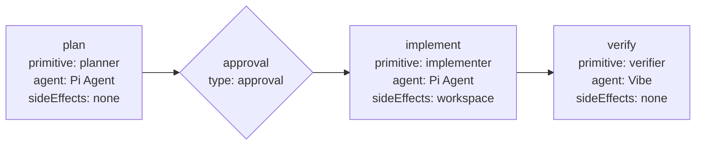
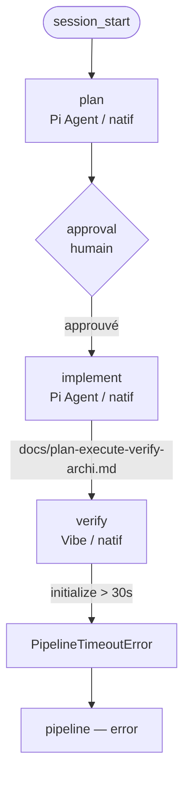
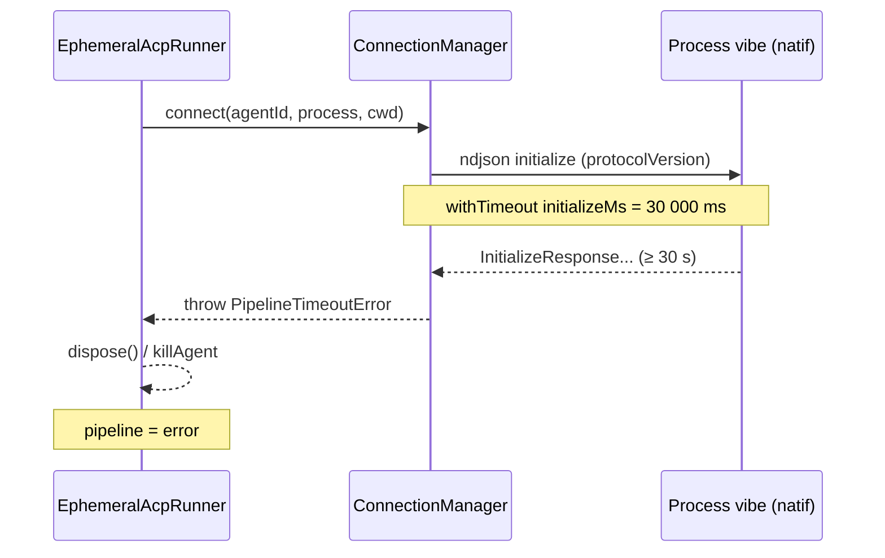

# Rétrospective d'exécution : pipeline `plan-execute-verify`

> **Pipeline exécuté** : `plan-execute-verify`
> (runtime actif : [`.acp/pipelines/plan-execute-verify.yaml`](../.acp/pipelines/plan-execute-verify.yaml))
> **Demande initiale** : « Fait un document pour expliqué l'architecture du projet »
> **Livrable visé** : [`docs/plan-execute-verify-archi.md`](./plan-execute-verify-archi.md)
> **Résultat final** : ❌ échec à l'étape `verify`
> (`ACP operation "initialize" timed out after 30000ms.`)

Ce document raconte **ce qui s'est réellement passé** lors de cette exécution, étape par étape,
et explique pourquoi les trois premières étapes ont réussi alors que la quatrième a échoué.
Il complète [`docs/plan-execute-verify-archi.md`](./plan-execute-verify-archi.md) (qui décrit
l'architecture théorique) en confrontant celle-ci au déroulé observé.

---

## Table des matières

1. [Le pipeline exécuté](#le-pipeline-exécuté)
2. [Chronologie](#chronologie)
3. [`plan` — réussite](#plan--réussite)
4. [`approval` — réussite](#approval--réussite)
5. [`implement` — réussite](#implement--réussite)
6. [`verify` — échec](#verify--échec)
7. [Cause-racine de l'échec](#cause-racine-de-léchec)
8. [Pourquoi `plan` et `implement` ont réussi](#pourquoi-plan-et-implement-ont-réussi)
9. [Recommandations](#recommandations)
10. [Glossaire](#glossaire)

---

## Le pipeline exécuté

Il existe **deux** copies du pipeline `plan-execute-verify` dans le dépôt :

| Fichier | Rôle | `planner` | `implementer` | `verifier` |
| --- | --- | --- | --- | --- |
| [`.acp/pipelines/plan-execute-verify.yaml`](../.acp/pipelines/plan-execute-verify.yaml) | Canonical / documenté | Cursor CLI | Vibe | Cursor CLI |
| [`.acp/pipelines/plan-execute-verify.yaml`](../.acp/pipelines/plan-execute-verify.yaml) | **Runtime actif** | Pi Agent | Pi Agent | **Vibe** |

C'est la seconde (sous `.pi/`) qui tourne réellement — la liste d'agents du journal d'exécution
(`Pi Agent`, `Pi Agent`, `Vibe`) le confirme. Les quatre étapes sont :



## Chronologie

| # | Étape | Primitive / type | Agent | Transport | Issue |
| --- | --- | --- | --- | --- | --- |
| 1 | `plan` | `planner` | Pi Agent | ACP natif | ✅ plan produit |
| 2 | `approval` | `type: approval` | — (humain) | — | ✅ approuvé |
| 3 | `implement` | `implementer` | Pi Agent | ACP natif | ✅ fichier livré + staged |
| 4 | `verify` | `verifier` | Vibe | ACP natif | ❌ timeout `initialize` |



---

## `plan` — réussite

L'agent **Pi Agent** (primitive `planner`, `sideEffects: none`) a reçu l'instruction :

> Create a decision-complete implementation plan only. Return exactly one
> `<proposed_plan>...</proposed_plan>` block.

Le planner a exploré le dépôt (`docs/`, `CONTEXT.md`, `.acp/`, `adr/`), puis a produit un plan
détaillé (~120 lignes couvrant objectif, décisions, structure de headings, spécification des 5
schémas Mermaid, critères d'acceptation et risques). Le livrable `output: proposed_plan` a bien
pris la forme d'un unique bloc `<proposed_plan>`.

**Pourquoi ça a marché** : `Pi Agent` = `npx pi-acp` (cf.
[`.acp/acp-agents.json`](../.acp/acp-agents.json)), lancé en **transport ACP natif** (spawn
de process direct, ndjson). Le runtime pi-acp était chaud (c'est le même hôte qui orchestre le
pipeline), donc l'opération [`initialize`](../src/acp/connectionManager.ts) s'est terminée loin
sous le budget de 30 s.

## `approval` — réussite

Étape `type: approval` (pas un agent : l'UI Pi demande à l'humain). L'`input` était
`{{steps.plan.output}}`. L'humain a approuvé ; la pipeline a repris sur l'étape `implement`.

> ⚠️ Cette **approbation d'étape** (pause humaine dans le pipeline) est un mécanisme distinct de la
> **promotion** Sandcastle (décision `applied` / `rejected` / `cancelled` sur un worktree isolé —
> voir [`CONTEXT.md`](../CONTEXT.md)). Ici aucun transport Sandcastle n'est impliqué.

## `implement` — réussite

L'agent **Pi Agent** (primitive `implementer`, `sideEffects: workspace`) a exécuté le plan approuvé
en une seule passe :

1. **Lecture des sources de vérité** : `docs/architecture.md`, `CONTEXT.md`,
   `.acp/pipelines/plan-execute-verify.yaml`, `adr/0005` à `adr/0009`, fichiers `src/acp/*` et
   `src/catalog/config.ts`.
2. **Écriture** de [`docs/plan-execute-verify-archi.md`](./plan-execute-verify-archi.md) via
   l'outil `write` — 333 lignes, 5 schémas Mermaid, 100 % français.
3. **Correctif de lint** : une erreur structurelle `MD056` (table cassée par des `|` inline non
   échappés dans la ligne « Promotion » du tableau de §5) a été corrigée en échappant les pipes
   (`\|`). Les 14 avertissements `MD013` restants (règle 80 col. par défaut) concernent les labels
   Mermaid et les cellules de tableau — incurables sans casser les schémas, et cohérents avec
   `docs/architecture.md` canonique (qui en déclenche 57 identiques).
4. **Vérifications** : tous les liens internes résolvent ; aucun terme interdit du glossaire
   (`CONTEXT.md`) n'a filtré.
5. **Staging** : `git add docs/plan-execute-verify-archi.md` (`git status` = `A` seul, aucune
   modification hors le `.md`).

Tous les critères d'acceptation du plan (§8) étaient cochés côté `implement`. La qualité du
livrable n'est **pas** en cause pour l'échec final.

---

## `verify` — échec

L'étape `verify` (primitive `verifier`, `agent: Vibe`, `sideEffects: none`) a démarré, et le
journal a affiché :

```
verify (Vibe) — implementing
Running verify with Vibe...
...
ACP operation "initialize" timed out after 30000ms.
```

Suit le statut pipeline global : `pipeline — error`.

Aucun `PromptResponse` n'a jamais été reçu : l'agent Vibe n'a même pas eu le temps de traiter le
prompt de vérification. L'échec intervient **avant** la session, **avant** l'appel `prompt` —
dès la poignée de main ACP `initialize`.

## Cause-racine de l'échec

### 1. Le message est un `PipelineTimeoutError`

La chaîne `ACP operation "initialize" timed out after 30000ms.` correspond exactement au
constructeur de [`PipelineTimeoutError`](../src/acp/operationGuards.ts) :

```ts
super(`ACP operation "${phase}" timed out after ${timeoutMs}ms.`);
```

avec `phase = "initialize"` et `timeoutMs = 30000`. La valeur `30000` vient du défaut
[`initializeMs: 30_000`](../src/acp/operationGuards.ts) (`DEFAULT_ACP_OPERATION_TIMEOUTS`),
aucune surcharge n'étant configurée.

### 2. Où le timeout frappe dans le code

La connexion est pilotée par [`ConnectionManager.connect`](../src/acp/connectionManager.ts),
qui encapsule l'appel `connection.initialize(...)` dans une garde double :

- [`withTimeout('initialize', initializeMs, …)`](../src/acp/operationGuards.ts) — rejette après
  30 s ;
- [`withProcessGuard('initialize', processExit, …)`](../src/acp/operationGuards.ts) — rejette si
  le process agent meurt avant.

Ici c'est la **première** garde qui a gagné la course : le process `vibe` était toujours vivant,
mais n'avait toujours pas renvoyé son `InitializeResponse` sur le flux ndjson au bout de 30 s.

### 3. `Vibe` résout vers le transport natif (pas Sandcastle)

Le pipeline déclare `verifier.agent: Vibe`. La résolution se fait par
[`loadPiAgentCatalog`](../src/catalog/config.ts), qui fusionne par **nom exact** :

- [`.acp/acp-agents.json`](../.acp/acp-agents.json) → `"Vibe": { command: "vibe" }`
  (transport natif par défaut, *pas* Sandcastle) ;
- [`.acp/.sandcastle/config.json`](../.acp/.sandcastle/config.json) → `"Vibe Sandcastle":
  { transport: "sandcastle", provider: "vibe" }` — **un autre nom**, non référencé par le
  pipeline.

Donc `readAgentConfig("Vibe")` renvoie l'entrée **native**. L'
[`EphemeralAcpRunner.connectAgent`](../src/acp/ephemeralRunner.ts) passe alors par
`defaultConnector` (spawn direct du process `vibe`, ndjson) — **pas** par le connecteur
Sandcastle (Docker + worktree). La sandbox Docker n'est donc pas en cause.

### 4. Hypothèse la plus probable : démarrage à froid du CLI `vibe`

Le connecteur natif spawn le process `command: "vibe"` puis attend l'`InitializeResponse`. Avec
`sideEffects: none`, l'
[`finishSandcastleRun`](../src/acp/ephemeralRunner.ts) n'est de toute façon pas atteint. Le
budget consommé (≥ 30 s) correspond au **temps pour que l'exécutable `vibe` démarre et réponde
au `initialize`** — typiquement un démarrage à froid : première invocation (téléchargement /
cache), Auth non établie, ou initialisation de modèle (`mistral-large-latest`) lente.



---

## Pourquoi `plan` et `implement` ont réussi

Ces deux étapes utilisaient l'agent **Pi Agent** (`npx pi-acp`), c'est-à-dire **le même runtime
que l'hôte Pi** qui orchestre le pipeline. En transport natif, ce process était :

- déjà installé en cache (`pi-acp` résolu via le manager de paquets de l'hôte) ;
- démarrant en quelques centaines de ms ;
- ne nécessitant pas d'Auth additionnelle.

Du coup `initialize` (et même `newSession` + `prompt`) s'est terminé largement sous 30 s.
L'asymétrie de coût de démarrage entre « Pi Agent » et « Vibe » est la cause directe de la
divergence réussite/échec entre étapes pourtant structurellement identiques.

## Recommandations

1. **Réchauffer le CLI `vibe`** avant la première pipeline, ou pré-authentifier la session
   (un warm-up `vibe` hors pipeline établit le cache et l'Auth). C'est la mitigation la plus
   immédiate, sans toucher au code.
2. **Surcharger `initializeMs`** pour Vibe. La config embarquée
   ([`config.ts`](../src/catalog/config.ts)) supporte déjà un bloc `timeouts`
   (`initializeMs`, `newSessionMs`, …) ; il suffit d'ouvrir le budget de `initialize` pour
   l'agent `Vibe` (par ex. 90 s). Cohérent avec ADR-0007 (config embarquée v1).
3. **Aligner `verify` sur un agent déjà chaud** : soit `Pi Agent` (comme `plan`/`implement`), soit
   le Cursor CLI natif du pipeline canonical. Le rôle du `verifier` (`sideEffects: none`,
   lecture + rapport) ne nécessite ni Vibe ni Sandcastle.
4. **Renommer pour lever l'ambiguïté** : `"Vibe"` (natif) vs `"Vibe Sandcastle"` (Docker) est un
   piège de nommage. Soit réserver `Vibe` au transport Sandcastle, soit documenter explicitement
   que `agent: Vibe` spawn un process local.
5. **Diagnostic runtime** : logger le temps écoulé de `initialize` même en cas de succès, pour
   détecter la dérive avant qu'elle ne frappe le timeout.
6. **Rendu** : corriger `pi-remnic` (les `Remnic observe failed: fetch failed` ont pollué le
   journal toute l'exécution) — bruit non bloquant mais qui masque les vrais messages.

> Aucune de ces recommandations n'ouvre de feature « v2 » : la surcharge de `timeouts` est déjà
> prévue par la config embarquée v1 (ADR-0007).

---

## Glossaire

- **Sandcastle** : mode d'exécution en Docker + worktree Git jetable, exposé comme transport
  ACP `sandcastle`. *Ici non utilisé* (l'agent `Vibe` résout vers le transport natif).
- **Run éphémère** : un run = un process bridge ACP né et mort pour ce run (cf.
  [`ephemeralRunner.ts`](../src/acp/ephemeralRunner.ts)).
- **Side effects** : propriété du *run* (`none` ou `workspace`), pas de l'agent. Les quatre
  étapes utilisaient `none`/`workspace` selon leur rôle.
- **`initialize`** : poignée de main ACP initiale ; échangée sur le flux ndjson avant toute
  session. Budgétisée à 30 s par défaut.
- **Promotion** : décision `applied` / `rejected` / `cancelled` sur un worktree Sandcastle —
  hors-sujet ici, mais distinct de l'**approbation d'étape** (`type: approval`).
- **Cancelled** : outcome de promotion sans décision explicite (pas applicable ici : aucun
  worktree n'a été créé).

---

## Pour aller plus loin

- Architecture cible : [`docs/plan-execute-verify-archi.md`](./plan-execute-verify-archi.md)
- Architecture générale : [`docs/architecture.md`](./architecture.md)
- Rétrospective précédente : [`docs/session-analysis.md`](./session-analysis.md)
- Glossaire canonique : [`CONTEXT.md`](../CONTEXT.md)
- Pipeline runtime : [`.acp/pipelines/plan-execute-verify.yaml`](../.acp/pipelines/plan-execute-verify.yaml)
- ADR : [ADR-0006](../adr/0006-annulation-runner-abortsignal.md) (annulation / `AbortSignal`),
  [ADR-0007](../adr/0007-configuration-embarquee-v1.md) (config embarquée v1),
  [ADR-0008](../adr/0008-plugin-pi-autonome.md) (autonomie vs `plugin-vscode`),
  [ADR-0009](../adr/0009-sandcastle-ephemere-sous-pi.md) (Sandcastle éphémère)
