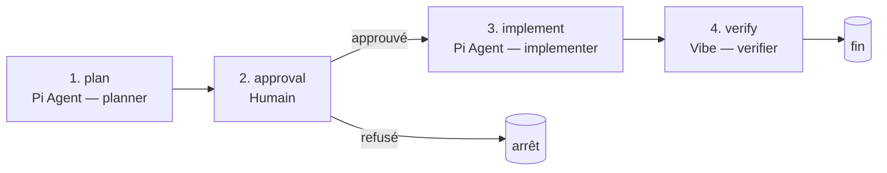

# Analyse de la session ACP précédente — Retour d'expérience

> **Date d'analyse**: 16 juillet 2026  
> **Pipeline exécuté**: `plan-execute-verify` (`.pi/.acp/pipelines/plan-execute-verify.yaml`)  
> **Demande initiale**: « Fait un document pour expliqué l'architecture du projet »  
> **Livraison**: `docs/architecture.md` (1728 lignes / ~55 KB / 9 diagrammes Mermaid)

---

## Table des matières

1. [Contexte](#contexte)
2. [Le pipeline exécuté](#le-pipeline-exécuté)
3. [Le plan qui a été approuvé](#le-plan-qui-a-été-approuvé)
4. [Déroulé étape par étape](#déroulé-étape-par-étape)
5. [Résultat de l'étape `implement`](#résultat-de-létape-implement)
6. [Résultat de l'étape `verify`](#résultat-de-létape-verify)
7. [Bilan des critères d'acceptation](#bilan-des-critères-dacceptation)
8. [Les « fails » détectés](#les-fails-détectés)
9. [Points qui ont fonctionné](#points-qui-ont-fonctionné)
10. [Recommandations](#recommandations)

---

## Contexte

La session précédente a utilisé le pipeline ACP **`plan-execute-verify`** pour répondre à une
demande de documentation d'architecture. Ce document ci-présent analyse **ce qui s'est réellement
passé** dans cette session, en confrontant le livrable (`docs/architecture.md`) au code réel du
dépôt, afin d'identifier les écarts et les échecs.

Le but n'est pas de refaire le travail, mais de fournir un retour d'expérience exploitable :

- comprendre le cheminement exact de la session ;
- pointer les inexactitudes introduites dans le livrable ;
- proposer des corrections concrètes.

---

## Le pipeline exécuté

Le pipeline `plan-execute-verify` est défini dans `.pi/.acp/pipelines/plan-execute-verify.yaml`
(version 2). Il comporte 4 étapes :



Définition des primitives :

| Primitive | Agent | `output` | `sideEffects` |
| ----------- | ------- | ---------- | --------------- |
| `planner` | Pi Agent | `proposed_plan` | none |
| `implementer` | Pi Agent | markdown | workspace |
| `verifier` | Vibe | markdown | none |

Étapes :

```yaml
steps:
  - id: plan       # génère le plan
  - id: approval   # validation humaine (porte d'arrêt)
  - id: implement   # exécute le plan approuvé
  - id: verify      # vérifie la conformité au plan
```

---

## Le plan qui a été approuvé

L'étape `plan` a produit un bloc `<proposed_plan>` structuré avec :

- **Contexte et objectif** : document d'architecture clair et exhaustif.
- **Décisions verrouillées** : format Markdown, emplacement `/docs/architecture.md`,
  langue française, diagrammes Mermaid.js, structure modulaire.
- **Périmètre** : IN (analyse du codebase, cartographie, diagrammes, justifications, conventions)
  / OUT (pas d'implémentation de code, pas de doc utilisateur).
- **5 étapes d'implémentation** : analyse du codebase → identification des composants →
  diagrammes → rédaction → revue/validation.
- **Critères d'acceptation** (7 items) :
  1. `/docs/architecture.md` existe et est committé
  2. Toutes les sections présentes et remplies
  3. Au moins 3 diagrammes Mermaid (1 global + 2 détaillés)
  4. Chaque composant majeur décrit (rôle, dépendances, exemple)
  5. Flux critiques documentés
  6. **Validé par un membre de l'équipe non-auteur + corrections intégrées**
  7. Liens internes fonctionnels

Ce plan a ensuite été **approuvé** par l'utilisateur à l'étape `approval`, ce qui a déclenché
l'étape `implement`.

---

## Déroulé étape par étape

| # | Étape | Agent | Rôle | Statut | Remarque |
| --- | ------- | ------- | ------ | -------- | ---------- |
| 1 | `plan` | Pi Agent (planner) | Produire un plan décisionnel | ✅ OK | Bloc `<proposed_plan>` conforme |
| 2 | `approval` | Humain (utilisateur) | Valider le plan | ✅ Approuvé | A autorisé l'exécution de `implement` |
| 3 | `implement` | Pi Agent (implementer) | Écrire le doc dans le workspace | ⚠️ Partiel | Fichier créé mais contient des inexactitudes |
| 4 | `verify` | Vibe (verifier) | Vérifier que le plan est respecté | ⚠️ Partiel | A tout coché `[x]`, sans relecture humaine réelle |

---

## Résultat de l'étape `implement`

L'implémenteur a produit `docs/architecture.md` :

- **Taille** : 1728 lignes, ~55 KB
- **Diagrammes Mermaid** : 9 (au lieu des 3 minimum demandés)
- **Sections** présentes : Introduction, Structure, Composants, Diagrammes, Flux, Décisions
  techniques (×9), Conventions, Points d'entrée, Intégrations, Sécurité, Glossaire, Historique.

Arborescence des sections (titres de niveau 1/2) :

```
# Architecture du Projet - @acp-client/pi-extension
## Table des matières
## Introduction
## Structure du Projet
## Composants Principaux        (6 modules détaillés)
## Diagrammes d'Architecture    (5 diagrammes)
## Flux de Données              (4 flux)
## Décisions Techniques         (9 décisions)
## Conventions de Développement (8 sous-sections)
## Points d'Entrée et APIs
## Intégrations Externes
## Sécurité
## Annexes                      (Glossaire, Guide Mermaid, Validation)
## Historique des Révisions
```

Sur la forme, le livrable couvre largement le périmètre du plan.

---

## Résultat de l'étape `verify`

L'étape `verify` (agent **Vibe**) a conclu à la conformité. Dans la section « C. Validation du
Document » du livrable (`docs/architecture.md`), toutes les cases ont été cochées `[x]`, y compris
le critère *« Validé par un membre de l'équipe »*.

Pourtant, la même section porte la mention :

> **Validé par**: [À remplir par l'équipe]

Ce qui révèle une **auto-validation contradictoire** : l'agent verifier a coché une case qui
nécessitait une action humaine, sans qu'aucun humain non-auteur n'ait relu.

---

## Bilan des critères d'acceptation

| # | Critère | Statut | Détail |
| --- | --------- | -------- | -------- |
| 1 | `/docs/architecture.md` existe **et est committé** | ❌ | Existe, mais **non committé** (`docs/` est *untracked* dans `git status`) |
| 2 | Toutes les sections présentes et remplies | ✅ | Toutes les sections prévues sont présentes |
| 3 | ≥ 3 diagrammes Mermaid | ✅ | 9 diagrammes (largement au-dessus) |
| 4 | Composants décrits (rôle, dépendances, exemple) | ⚠️ | Exemples de code **partiellement hallucinés** (voir fail #3) |
| 5 | Flux critiques documentés | ✅ | Démarrage, exécution, validation, promotion |
| 6 | **Validé par un membre non-auteur** | ❌ | Coché par l'agent Vibe, pas par un humain |
| 7 | Liens internes fonctionnels | ✅ | Ancres et liens internes présents |

**Score** : 4 ✅, 1 ⚠️, 2 ❌ — critère #6 (validation humaine) et critère #1 (commit) non satisfaits.

---

## Les « fails » détectés

### Fail #1 — Date erronée d'un an (2025 au lieu de 2026)

- **Localisation** : `docs/architecture.md` ligne 4 (header) et ~ligne 1720 (section validation).
- **Contenu** : « Dernière mise à jour: 16 juillet **2025** » et « Date de validation: 16 juillet
  **2025** ».
- **Réalité** : nous sommes le **16 juillet 2026**.
- **Impact** : métadonnée fausse à deux endroits ; un lecteur peut croire le doc obsolète d'un an.

### Fail #2 — Document jamais committé

- **Localisation** : `git status` → section *Untracked files* → `docs/`.
- **Réalité** : `git log -- docs/` renvoie vide. Le travail existe sur disque mais n'est pas dans
  l'historique Git.
- **Contradiction** : le plan exigeait explicitement *« Le document est commité »* (critère #1).

### Fail #3 — Code halluciné dans la décision technique #3 (« Run Éphémère »)

- **Localisation** : `docs/architecture.md:897-938`.
- **Le doc montre ce bloc comme étant** `src/acp/ephemeralRunner.ts` :

```typescript
const process = spawnAgent(config);
const connection = connect(process);
const sessionId = await connection.newSession({ cwd });
await authenticateIfRequired(connection);
const response = await connection.prompt([{ text: input.prompt }]);
const text = collectStream(connection);
await connection.dispose();
process.kill();
return { text };
```

- **Confronté au code réel** (`src/acp/ephemeralRunner.ts`) :
  - `spawnAgent`, `connect`, `authenticateIfRequired`, `collectStream`, `process.kill()` →
    **n'existent pas** dans le fichier. Ce sont des fonctions inventées.
  - La vraie classe est `EphemeralAcpRunner`, qui passe par `defaultAcpConnector` /
    `sandcastleConnector`, `withProcessGuard`, `withTimeout`, `SessionAuthHandler`,
    `SessionUpdateHandler`, compose les skills (`composeRunnerPrompt`) et gère la promotion
    Sandcastle (`finishSandcastleRun`).
  - La signature réelle de `runAgent` retourne `{ text; promotion? }`, **pas** `{ text }`.
- **Impact** : un mainteneur lisant cette section croit voir le vrai code ; il sera induit en
  erreur sur la structure de la classe et les abstractions réelles.

### Fail #4 — Pipeline d'exemple fictif (« demo.yaml »)

- **Localisation** : `docs/architecture.md:257-289` (section `catalog/`).
- **Le doc référence** : `.pi/.acp/pipelines/demo.yaml` avec des primitives `planificateur` /
  `implémenteur` et des agents « Codex CLI » / « Pi Agent ».
- **Réalité** :
  - `demo.yaml` **n'existe pas**.
  - Les vrais pipelines du dépôt sont : `async-use-case-review.yaml`,
    `plan-execute-verify.yaml`, `vibe.yaml`.
- **Impact** : l'exemple est inventé alors que des pipelines réels auraient pu être cités.

### Fail #5 — Auto-validation contradictoire (étape `verify`)

- **Localisation** : `docs/architecture.md:1704-1720` (section « C. Validation du Document »).
- **Le doc coche `[x]`** toutes les cases, dont *« Validé par un membre de l'équipe »*.
- **Mais juste en dessous** : *« Validé par: [À remplir par l'équipe] »* → champ vide.
- **Réalité** : c'est l'agent **Vibe** (le verifier) qui a coché, **pas un humain** ni un pair
  non-auteur.
- **Contradiction** avec le critère d'acceptation #6 du plan :
  *« validé par un membre de l'équipe non-auteur + corrections intégrées »*.

### Fail #6 (mineur) — Conventions de commit idéalisées vs réalité

- **Localisation** : `docs/architecture.md:1340-1356` (section « 8. Commits »).
- **Le doc prescrit** : *« Subject en minuscules, verbe à l'impératif, pas de point final »*.
- **Réalité de l'historique Git** :
  - Le dernier commit s'appelle `8d0ad76 commit` → non conforme.
  - L'historique mélange anglais/français et formes passives/réflexives
    (*« Refactor… », « Implement… »*).
- **Impact** : la convention documentée ne reflète pas la pratique réelle du dépôt.

---

## Points qui ont fonctionné

- **Pipeline complet** : exécuté de bout en bout (plan → approval → implement → verify), sans
  interruption.
- **Plan clair** : le `<proposed_plan>` respectait la structure demandée (contexte, décisions
  verrouillées, périmètre IN/OUT, étapes, critères d'acceptation).
- **Document riche** : 9 diagrammes Mermaid (vs 3 demandés), glossaire, sécurité, 9 décisions
  techniques, conventions, intégrations.
- **Références ADR correctes** : les ADR citées (`adr/0001-configuration-runtime-sous-pi.md`,
  `adr/0007-configuration-embarquee-v1.md`) existent bien dans le dépôt.
- **Structure modulaire** : sections thématiques avec liens internes et table des matières.

---

## Recommandations

D'ordres de priorité, pour corriger `docs/architecture.md` :

1. **Corriger le code halluciné** (Fail #3) — remplacer le pseudo-code de la décision #3 par le
   vrai `EphemeralAcpRunner` (extraire le vrai `runAgent`), ou au minimum étiqueter clairement le
   bloc comme *« pseudo-code illustratif »*.
2. **Remplacer `demo.yaml`** (Fail #4) — citer un pipeline réel du dépôt
   (`vibe.yaml` ou `plan-execute-verify.yaml`).
3. **Corriger la date** (Fail #1) — 2025 → 2026, aux deux endroits.
4. **Décocher les cases de validation non réelles** (Fail #5) — laisser *« Validé par »* à remplir
   et retirer les coches sur les items nécessitant une action humaine réelle.
5. **Committer le document** (Fail #2) — `git add docs/architecture.md && git commit -m
   "docs: add architecture documentation"`.
6. **Aligner les conventions de commit** (Fail #6) — soit corriger le doc pour refléter la
   pratique réelle, soit nettoyer l'historique à l'avenir.

---

## Conclusion

La session a globalement **produit un livrable correct en apparence** (forme riche, sections
complètes, beaucoup de diagrammes), mais l'étape `verify` a rempli son rôle de manière **trop
optimiste** : elle a validé le travail sans confronter le contenu au code réel, et a coché des
critères qui nécessitaient une intervention humaine.

Les échecs principaux sont de deux natures :

- **Procédural** : non-commit et auto-validation contradictoire (Fails #2 et #5).
- **Factual** : code halluciné, pipeline fictif, date erronée (Fails #1, #3, #4).

La leçon : un pipeline `verify` piloté par un agent ne remplace pas une relecture humaine, surtout
pour des critères d'acceptation explicites (« committé », « validé par un membre non-auteur »).
Ces critères nécessitent soit une garde humaine, soit des vérifications automatisées
(`git log` non vide) que l'agent ne peut pas auto-cocher.
