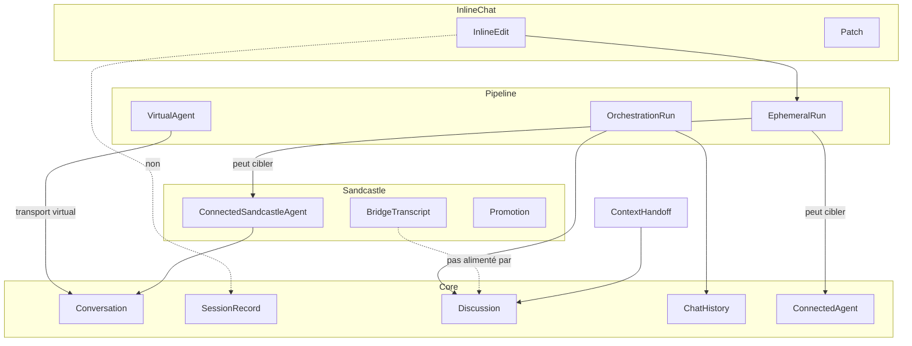

# Carte des contextes

Extension VS Code qui connecte l’éditeur à des agents ACP, avec orchestration optionnelle (pipelines / équipes), isolation Sandcastle et édition inline. Le vocabulaire partagé sur les agents et les conversations vit dans **Core** ; les autres contextes étendent l’exécution sans redéfinir ces termes.

## Contextes

| Contexte | Glossaire | Domaine |
|----------|-----------|---------|
| [Core](./src/core/CONTEXT.md) | Agents, Conversation, SessionRecord, Discussion, ChatHistory, transport, handoff de contexte | Chat interactif, index de persistance, cycle de vie client ACP |
| [Pipeline et orchestration](./src/pipeline/CONTEXT.md) | VirtualAgent, Pipeline, AgentTeam, EphemeralRun, OrchestrationRun | Workflows LangGraph exposés comme agents virtuels |
| [Sandcastle](./src/sandcastle/CONTEXT.md) | IsolatedRuntime, BridgeTranscript, Promotion, ProviderRun | Isolation worktree Docker et Apply / Reject |
| [Inline chat](./src/inlineChat/CONTEXT.md) | InlineEdit, EditProposal, Patch, ActiveAgentResolver | Éditions en inset éditeur, parallèles au chat principal |

## Relations

- **Core → Pipeline** : Core achemine les prompts des VirtualAgents vers le transport virtual. L’OrchestrationRun apparaît comme une Conversation normale dans l’arbre et le chat.
- **Pipeline → Sandcastle** : un PipelineStep peut invoquer un ConfiguredAgent Sandcastle via EphemeralRun (avec Promotion optionnelle), ou l’utilisateur peut connecter un agent Sandcastle pour une Conversation directe.
- **Core → Sandcastle** : le ConnectedSandcastleAgent utilise le même modèle Conversation / ChatHistory / SessionRecord ; le BridgeTranscript est un contexte provider propre au bridge.
- **Inline chat → Pipeline** : les deux peuvent utiliser EphemeralRun ; l’édition inline n’utilise pas SessionRecord ni l’index d’arbre. Le seam **ActiveAgentResolver** ([Inline chat](./src/inlineChat/CONTEXT.md)) isole le choix d’agent de `SessionManager`.
- Les termes définis une seule fois dans Core (`ConfiguredAgent`, `Conversation`, `Discussion`, `ChatHistory`, `SessionRecord`, `Transport`) sont référencés, pas redéfinis, dans les autres glossaires.

---

## Scénarios limites (validés)

Tests de stress pour situer les frontières. Les termes canoniques renvoient à [Core](./src/core/CONTEXT.md) et aux glossaires voisins.

### 1. Bascule Codex natif → Codex Sandcastle

| Élément | Survit ? |
|---------|----------|
| Processus ConnectedAgent | Non — l’agent précédent est déconnecté ; nouveau bridge lancé |
| Identifiant ProtocolSession | Non — nouvelle Conversation |
| ChatHistory dans le panneau | Effacée à NewConversation / changement d’agent (chat vide jusqu’aux nouveaux prompts) |
| Discussion sur l’ancien SessionRecord | Oui — reste sur l’ancien SessionRecord |
| ContextHandoff vers Sandcastle | Uniquement si l’utilisateur utilise explicitement connecter-avec-contexte ; injection one-shot au prochain prompt |
| BridgeTranscript | Neuf pour la nouvelle Conversation bridge |
| Mémoire provider dans Docker | Pas de reprise native — chaque ProviderRun s’appuie uniquement sur BridgeTranscript |

**Hors périmètre** : migration automatique de l’état provider natif vers Sandcastle.

### 2. Ouvrir un SessionRecord passé depuis l’arbre

| Capacité | ChatHistory | Discussion sur SessionRecord |
|----------|-------------|------------------------------|
| Agent supporte **load** | Effacée au début du load ; reconstruite par replay ACP `session/update` pendant le load | Effacée avant load ; reconstruite à partir des chunks texte streamés pendant le replay |
| Agent supporte **resume** seulement | **Pas** effacée par le replay de load — l’utilisateur est averti que l’ouverture remplace le chat, mais l’historique visible peut être en retard jusqu’à de nouvelles mises à jour | Non effacée au resume ; Discussion antérieure conservée sur l’enregistrement |
| Agent Sandcastle | Pas de load / resume sur le bridge — l’arbre affiche uniquement les SessionRecords en cache local | Discussion sur l’enregistrement si déjà capturée ; BridgeTranscript non restauré depuis l’enregistrement |

**Alignement README** : le README décrit correctement load vs resume. **Écart** : le chemin resume ne réinitialise pas ChatHistory comme load — ouvrir via resume peut laisser une ChatHistory obsolète jusqu’à de nouveaux messages ou un nouveau départ.

### 3. Pipeline avec implementer Sandcastle

| Couche | Ce que voit l’utilisateur |
|--------|---------------------------|
| OrchestrationRun | Une Conversation virtual — sortie planner, UI d’approbation, timeline dans ChatHistory |
| EphemeralRun dans une étape | Sortie de l’étape intégrée dans la même ChatHistory d’OrchestrationRun (via mises à jour pipeline), pas une ligne d’arbre séparée |
| ConnectedSandcastleAgent (chat direct) | Conversation distincte si l’utilisateur a connecté cet agent directement — différent du run Sandcastle éphémère du pipeline |

La Promotion après un **EphemeralRun** Sandcastle avec effets workspace est gérée dans l’étape ; la Conversation virtual principale continue.

### 4. ContextHandoff

| Stockage | Rôle dans le handoff |
|----------|----------------------|
| **Discussion** | Matière source — texte user/assistant borné depuis le SessionRecord source |
| **PendingHandoff** | La Conversation cible détient le texte injecté jusqu’au prochain envoi de prompt |
| **ChatHistory** | Inchangée par la configuration du handoff ; l’utilisateur voit encore le panneau actuel jusqu’à ouvrir la cible ou envoyer un prompt |
| **BridgeTranscript** | Non affecté — le handoff n’alimente pas le contexte provider Sandcastle |

Après l’envoi du prochain prompt, PendingHandoff est consommé — la Discussion n’est pas réinjectée aux prompts suivants.

### 5. Édition inline sur le même fichier que le chat actif

| Question | Réponse |
|----------|---------|
| Même Conversation ? | Non — chemin InlineEdit parallèle |
| SessionRecord / arbre | Non créés |
| Discussion / ChatHistory | Non mises à jour |
| ConfiguredAgent | Préfère le ConnectedAgent actif s’il n’est pas VirtualAgent ; sinon le premier agent non virtual du workspace |
| EphemeralRun | Oui — spawn séparé par requête d’édition |

---

## Diagnostic de dispersion

### Séparation légitime (intentionnelle — ne pas fusionner à la légère)

| Séparation | Pourquoi elle existe |
|------------|----------------------|
| Transport : `nativeAcp` / `virtual` / `sandcastle` | Modèles de processus différents ; UX unifiée via Core (ADR-0015) |
| **Discussion** vs **ChatHistory** | Handoff et familles ont besoin de texte plat borné ; l’UI a besoin d’outils, tours, blocs pipeline |
| **BridgeTranscript** vs **Discussion** | Le provider dans Docker ne peut pas utiliser le store client ; injection bornée par ProviderRun (ADR-0014) |
| **SessionRecord** vs **ProtocolSession** | Index local et handoff vs identifiant et capacités côté agent |
| **EphemeralRun** vs **ConnectedAgent** | Les étapes pipeline et l’inline ne doivent pas occuper le seul slot de connexion interactive |
| Plugins optionnels (orchestration, commandes Sandcastle, inline chat) | Surfaces optionnelles ; Core reste conscient du transport sans couplage fonctionnel |
| **InlineEdit** parallèle à Conversation | Contrat UX différent (inset patch vs fil de chat) |

### Dispersion réelle (dette de vocabulaire ou de frontière — documenter maintenant ; code plus tard si besoin)

| Problème | Symptôme | Correction canonique (langage) |
|----------|----------|--------------------------------|
| « Session » surchargé | Même mot pour id protocole, Conversation, SessionRecord, snapshot UI, paire bridge | Toujours qualifier : ProtocolSession, Conversation, SessionRecord, BridgeConversation, SessionSnapshot |
| Resume vs reset ChatHistory | Ouvrir via resume peut ne pas effacer ChatHistory comme load | Traiter comme écart d’implémentation ; le terme **historyReplayed** distingue load de resume |
| Deux chemins de connexion agent | EphemeralRun et ConnectedAgent utilisent des adaptateurs distincts | **EphemeralRun** → `AgentConnectionFactory` ; **ConnectedAgent** → `SessionConnector` (ADR-0015 — pas de fusion des lifecycles) |
| Inline chat orphelin | Pas d’arbre, pas de SessionRecord, pas de handoff | Accepter comme contexte séparé ; documenté dans [Inline chat](./src/inlineChat/CONTEXT.md) |
| Champs pipeline dans l’état chat partagé | La timeline pipeline vivait dans ChatHistory | **ConversationProjector** (host) + **OrchestrationProjector** (slice webview) + `OrchestrationWebviewStateStore` (`ORCHESTRATION_STATE_KEY`) |
| Documentation scindée | `docs/` EN vs `doc_fr/` pas à 100 % alignés | Glossaires en français avec termes canoniques EN ; README.fr non synchronisé automatiquement |
| Plans avancés (`docs/plans/omnigent/`) | Décrit un domaine absent de `src/` | Hors périmètre de ces glossaires tant que non implémenté |

### Réponse rapide : « C’est quoi une session ici ? »

Il n’y a pas une seule **session**. Préciser laquelle :

1. **ProtocolSession** — identifiant côté agent
2. **Conversation** — fil dans lequel vous discutez maintenant
3. **SessionRecord** — ligne sauvegardée dans l’arbre
4. **BridgeConversation** — paire bridge Sandcastle + sandbox (Sandcastle uniquement)

---

## Documentation associée

- ADR : [docs/adr/](./docs/adr/) (notamment 0007 handoff, 0014 historique Sandcastle, 0015 transport virtual)
- Vue utilisateur : [README.md](./README.md) · [README.fr.md](./README.fr.md)
