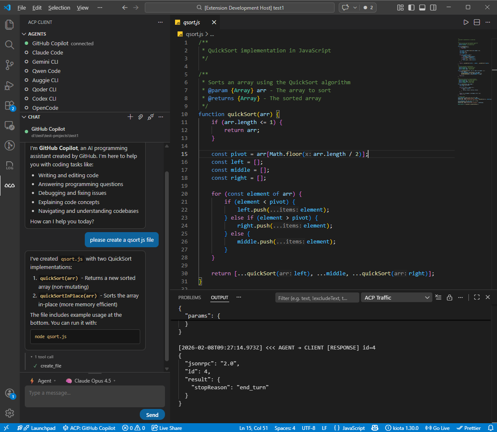

# ACP Client for VS Code

[Français](README.fr.md)

A [Visual Studio Code extension](https://marketplace.visualstudio.com/items?itemName=damien-huyet.acp-client) that connects your editor to any [Agent Client Protocol (ACP)](https://agentclientprotocol.com/) coding agent — native CLIs on the host, or isolated Codex/Cursor runs in Docker via Sandcastle.

> [!NOTE]
> Fork of [vscode-acp](https://github.com/formulahendry/vscode-acp) by [formulahendry](https://github.com/formulahendry), extended with pipelines, Sandcastle isolation, and workspace-scoped session history.



## Quick start

1. Install from the [Marketplace](https://marketplace.visualstudio.com/items?itemName=damien-huyet.acp-client) | [Open in VS Code](https://vscode.dev/redirect?url=vscode%3Aextension%2Fdamien-huyet.acp-client) | [Open VSX](https://open-vsx.org/extension/damien-huyet/acp-client)
2. Open the **ACP Client** activity bar (ACP icon)
3. In **Agents**, click **+** to add a configuration or pick a default
4. Connect to an agent, then chat in the **Chat** panel

For Sandcastle agents (Codex/Cursor in Docker), complete the [Sandcastle setup](#sandcastle-docker-agents) first.

## Requirements

| Component | Needed for |
|-----------|------------|
| **Node.js 18+** | Spawning native ACP agent processes |
| **ACP-compatible agent** | On `PATH` or via `npx` (see [pre-configured agents](#pre-configured-agents)) |
| **Docker** | Sandcastle-backed Codex and Cursor agents only |
| **Git repo** | Sandcastle git worktrees (Apply/Reject promotion) |

---

## Feature overview

### Chat and sessions

- **Interactive chat** — Markdown rendering, streaming assistant text, collapsible tool calls, thinking blocks with elapsed time
- **Single active agent** — one agent connected at a time; switch agents from the tree
- **Session tree** — expand each agent to browse past sessions; click to open or resume
- **Session capabilities** — uses agent-native `session/list`, `session/load`, and `session/resume` when advertised; falls back to a **workspace-scoped local cache** otherwise
- **Session config options** — dynamic toolbar selectors (mode, model, reasoning level, …) from the agent
- **Slash commands** — autocomplete for agent-provided commands
- **File mentions** — type `@` in the composer to attach workspace file paths
- **Chat persistence** — conversation state survives panel switches; open chat in the sidebar or editor

### Context and editor integration

- **Editor context link** (opt-in) — inject current file, cursor, selection, language, and open editors into prompts
- **Context handoff** — explicitly pass the current discussion to another agent or session (one-shot injection on the next prompt only)
- **Context families** — related sessions are linked in the tree when context is shared
- **File system and terminal** — agents read/write workspace files and run commands through ACP handlers
- **Permissions** — configurable auto-approve (`ask` or `allowAll`)

### Orchestration

- **LangGraph pipelines** — orchestration engine: virtual agents from `.acp/pipelines/*.yaml` (approval gates, custom steps, parallel branches)
- **Plan Execute Verify** — default pipeline v2 workflow with role prompts attached through `promptFile`

### Isolation runtimes

Two ways agents interact with your workspace:

| Runtime | Agents | Where it runs | Promotion |
|---------|--------|---------------|-----------|
| **Native ACP** | Claude, Vibe, Codex CLI, … | Host process | Direct workspace writes (default) |
| **Sandcastle** | Codex Sandcastle, Cursor Sandcastle | Docker + git worktree | **Apply** / **Reject** commands |

See [Native ACP vs Sandcastle](#native-acp-vs-sandcastle-docker) for when to use each.

### Developer tooling

- **Protocol traffic** — full ACP JSON-RPC log in the ACP Traffic output channel
- **Debug snapshots** — in-memory trace panel (view, copy, export)
- **Agent registry** — browse discoverable ACP agents
- **Inline chat** (experimental) — editor inset prompt via proposed `editorInsets` API; requires Insiders for full UX

---

## Native ACP vs Sandcastle (Docker)

The chat UI is identical. What changes is **where the agent runs**, **how memory works**, and **how file changes reach your workspace**.

### Comparison

| | **Native ACP** | **Sandcastle** |
|---|----------------|----------------|
| **Transport** | `transport: "acp"` (default) | `transport: "sandcastle"` |
| **Process** | `npx` / local CLI on your machine | Codex or Cursor CLI inside Docker |
| **Filesystem** | Writes to workspace directly | Isolated git worktree until promotion |
| **Conversation memory** | Agent keeps state via `sessionId`; load/resume when supported | Bridge rebuilds a **bounded text transcript** (8 turns, 64 KiB) — [ADR-0014](docs/adr/0014-sandcastle-bounded-prompt-history.md) |
| **Session list / resume** | Yes, when the agent supports it | No native provider resume in Sandcastle 0.6.4 |
| **Best for** | Long threads, resuming past sessions, full provider features | **Fresh runs**, safe spikes, experiments without touching your tree |

Same provider, two modes:

| Settings entry | What you get |
|----------------|--------------|
| **Codex CLI** | Native ACP on the host |
| **Codex Sandcastle** | Codex in Docker with explicit Apply/Reject |
| **Cursor CLI** | Native ACP on the host (`agent acp`) |
| **Cursor Sandcastle** | Cursor in Docker with explicit Apply/Reject |

### Working with fresh agents

A **fresh** agent starts without baggage from earlier turns, tool noise, or half-finished edits.

**Native ACP** sessions are long-lived: the process accumulates context and may resume past sessions. Use **New Conversation** when you want a clean break without Docker.

**Sandcastle** pushes isolation further:

1. **Filesystem** — edits stay in a disposable worktree (`sandcastle/acp/<provider>/<uuid>`) until you promote them.
2. **Provider run** — each prompt is a new `sandbox.run()`; only the last few turns are injected as plain text.
3. **Explicit reset** — **Apply** or **Reject** tears down the sandbox and clears bridge-side history.
4. **New session** — a new ACP session gets a new branch and container context.

| Goal | Approach |
|------|----------|
| Try a risky change safely | Sandcastle → prompt → Show Diff → Apply or Reject |
| Fully reset filesystem + provider context | **Reject** (or Apply if done), then **New Conversation** |
| Compare two implementations | Two Sandcastle sessions, or Reject between attempts |
| Multi-day investigation with full memory | Native agent with session resume |
| Pipeline step must not touch `main` yet | Use a **Sandcastle** agent for a workspace-changing pipeline primitive |

### Sandcastle workflow (daily use)

1. Connect to **Codex Sandcastle** or **Cursor Sandcastle**
2. Send a focused prompt (one clear goal per run works best — context is capped)
3. Review: **ACP: Sandcastle Show Diff**
4. Promote: **ACP: Sandcastle Apply Changes** or **ACP: Sandcastle Reject Changes**
5. For the next isolated task, start fresh with Reject or **New Conversation**

---

## Pre-configured agents

### Sandcastle (Docker)

| Agent | Runtime |
|-------|---------|
| Codex Sandcastle | Docker + `codex("gpt-5.4")` |
| Cursor Sandcastle | Docker + `cursor("composer-2")` |

### Native ACP (host)

| Agent | Command |
|-------|---------|
| GitHub Copilot | `npx @github/copilot-language-server@latest --acp` |
| Claude Code | `npx @agentclientprotocol/claude-agent-acp@latest` |
| Gemini CLI | `npx @google/gemini-cli@latest --experimental-acp` |
| Qwen Code | `npx @qwen-code/qwen-code@latest --acp --experimental-skills` |
| Auggie CLI | `npx @augmentcode/auggie@latest --acp` |
| Qoder CLI | `npx @qoder-ai/qodercli@latest --acp` |
| Codex CLI | `npx @zed-industries/codex-acp@latest` |
| Cursor CLI | `agent acp` |
| Vibe | `vibe-acp` |
| OpenCode | `npx opencode-ai@latest acp` |
| OpenClaw | `npx openclaw acp` |
| [Kiro CLI](https://kiro.dev/docs/cli/acp/) | `kiro-cli acp` |
| [Hermes Agent](https://hermes-agent.nousresearch.com/docs/user-guide/features/acp) | `hermes acp` |
| [Pi Agent](https://github.com/svkozak/pi-acp) | `npx -y pi-acp` |

Add custom entries under `.acp/acp-agents.json`. Each entry is either:

```json
{ "command": "npx", "args": ["@agentclientprotocol/claude-agent-acp@latest"], "env": {}, "transport": "acp" }
```

or Sandcastle:

```json
{ "transport": "sandcastle", "provider": "codex", "model": "gpt-5.4", "effort": "high", "env": {} }
```

> **Hermes** is a Python package — install via the [Hermes quickstart](https://hermes-agent.nousresearch.com/docs/getting-started/quickstart) (Linux/macOS/WSL2). Put `hermes` on `PATH` and launch VS Code from the same shell.

> **Vibe** must be installed separately; `vibe-acp` must be on `PATH`.

---

## Sandcastle (Docker) agents

### One-time setup

```bash
# Export provider API keys in your shell or pass them through .acp/acp-agents.json env.

docker build \
  --build-arg AGENT_UID="$(id -u)" \
  --build-arg AGENT_GID="$(id -g)" \
  -t acp-client-sandcastle:local \
  -f .sandcastle/Dockerfile .
```

Verify CLIs inside the image:

```bash
docker run --rm --entrypoint sh acp-client-sandcastle:local \
  -lc 'id && codex --version && cursor-agent --version'
```

### Smoke tests

```bash
npm run sandcastle:smoke:codex    # Apply transfers a sentinel file
npm run sandcastle:smoke:cursor   # Reject keeps main workspace clean
```

### Limits (POC)

- Text prompts only (no images/audio)
- One prompt at a time per session
- Bridge history is volatile (lost on restart or after Apply/Reject)
- Outbound Docker network is unrestricted (API access required)
- Windows not tested for the Sandcastle bridge

Docs: [architecture](docs/sandcastle-architecture.md) · [first test guide](docs/sandcastle-first-test.md) · [ADR-0013](docs/adr/0013-acp-sandcastle-bridge.md) · [ADR-0014](docs/adr/0014-sandcastle-bounded-prompt-history.md)

French changelog: [docs/sandcastle-changelog-fr.md](docs/sandcastle-changelog-fr.md)

---

## Pipelines

Pipelines v2 are the canonical orchestration format. Earlier `.acp/teams/*.yaml` agent-team definitions have been removed; express role-based workflows directly as `.acp/pipelines/*.yaml`.

```text
Pipeline v2 (.acp/pipelines/*.yaml)
        │  LangGraph graph
        ▼
ACP agents (Codex CLI, Vibe, Cursor CLI, …)
```

When `acp.pipeline.enabled` is `true`, each valid pipeline appears as a virtual agent in the tree.

1. Connect to the pipeline agent
2. Send a prompt — LangGraph runs the workflow
3. Review or edit the plan at the approval step
4. Approve to continue, or reject to stop
5. Later steps invoke configured ACP agents (Sandcastle agents isolate workspace-changing steps)

See [docs/pipeline-a2a.md](docs/pipeline-a2a.md) · French: [doc_fr/pipelines-langgraph.md](doc_fr/pipelines-langgraph.md)

```yaml
version: 2
id: plan-execute-verify
title: Plan Execute Verify

primitives:
  planner:
    agent: Cursor CLI
    output: proposed_plan
    sideEffects: none
    promptFile: ../agents/planner.md
    prompt: |
      User request:
      {{userPrompt}}

steps:
  - id: plan
    use: planner
```

---

## Workspace configuration

The extension reads configuration only from the currently opened workspace:

- `.acp/acp-agents.json`
- `.acp/pipelines/*.yaml`
- `.acp/agents/*.md` when referenced by `promptFile`
- `.sandcastle/` for Sandcastle scaffold and provider environment files
- `.agents/skills/` for optional skill injection

There is no bundled workspace starter. To use the same setup in another project, copy the root `.acp`, `.sandcastle`, and `.agents` folders into that project.

---

## Agent Skills

The extension can wire repository skills from `.agents/skills/` for **Cursor CLI**, **Codex Sandcastle**, and **Cursor Sandcastle**.

- **Direct chat** — on the first message of a session, the extension injects an `<available_skills>` catalog (name + description for model-invoked skills). User-invoked skills remain available via `/skill-name`.
- **`/skill` invocation** — a message starting with `/tdd` (for example) is expanded to the full `SKILL.md` content before it is sent to the agent.
- **Cursor CLI** — when `.cursor/skills` is missing, the extension creates a symlink to `.agents/skills` for native CLI discovery.
- **Sandcastle** — the host `.agents/` folder is mounted into the container so Codex/Cursor can see skills even when they are not yet committed in the ephemeral worktree.

Per-agent opt-out: set `"skills": false` on the `.acp/acp-agents.json` entry.

---

## Settings

| Setting | Default | Description |
|---------|---------|-------------|
| `.acp/acp-agents.json` | native + 2 Sandcastle | Workspace agent configs (`transport: "acp"` or `"sandcastle"`) |
| `acp.autoApprovePermissions` | `ask` | Permission requests: `ask` or `allowAll` |
| `acp.defaultWorkingDirectory` | `""` | Session cwd; empty = workspace root |
| `acp.logTraffic` | `true` | Log ACP JSON-RPC to ACP Traffic channel |
| `acp.terminal.visible` | `false` | Show ACP command terminals for debugging only |
| `acp.pipeline.enabled` | `true` | Load `.acp/pipelines/` |
| `acp.instructions.maxBytes` | `262144` | Max size for pipeline `promptFile` Markdown files |
| `acp.skills.enabled` | `true` | Enable workspace skills wiring |
| `acp.skills.directory` | `.agents/skills` | Skills directory to scan |
| `acp.skills.maxCatalogBytes` | `65536` | Max injected catalog size on first prompt |
| `acp.skills.agents` | Cursor CLI, Codex/Cursor Sandcastle | Agents that receive skills |

---

## Commands

### Connection and chat

| Command | Description |
|---------|-------------|
| `ACP: Connect to Agent` | Connect to a configured agent |
| `ACP: Connect With Current Context` | Connect and hand off current discussion (one-shot) |
| `ACP: Open Session With Current Context` | Open/resume a session with pending context |
| `ACP: New Conversation` | New session with the connected agent |
| `ACP: Send Prompt` | Send a message |
| `ACP: Cancel Current Turn` | Cancel in-progress turn |
| `ACP: Disconnect Agent` | Disconnect |
| `ACP: Restart Agent` | Restart the agent process |
| `ACP: Open Chat Panel` | Focus chat sidebar |
| `ACP: Open Chat in Editor` | Open chat as editor tab |
| `ACP: Move Chat to Editor` | Move sidebar chat to editor |

### Sessions tree

| Command | Description |
|---------|-------------|
| `ACP: Refresh Sessions` | Re-fetch session list for an agent |
| `ACP: Open Session` | Load or resume a selected session |
| `ACP: Load More Sessions` | Paginate agent session list |
| `ACP: Forget Session` | Remove local session record |
| `Copy Session ID` | Copy session ID to clipboard |

### Sandcastle

| Command | Description |
|---------|-------------|
| `ACP: Sandcastle Show Diff` | Preview worktree patch |
| `ACP: Sandcastle Apply Changes` | Apply patch to main workspace |
| `ACP: Sandcastle Reject Changes` | Discard worktree changes |

### Pipelines

| Command | Description |
|---------|-------------|
| `ACP: Enable / Disable Pipeline Agents` | Toggle `acp.pipeline.enabled` |

### Configuration and debug

| Command | Description |
|---------|-------------|
| `ACP: Add / Remove Agent Configuration` | Manage `.acp/acp-agents.json` |
| `ACP: Set Agent Mode` / `Set Agent Model` | Legacy toolbar pickers |
| `ACP: Enable / Disable Editor Context Link` | Toggle editor context injection |
| `ACP: Show Log` | Extension log channel |
| `ACP: Show Protocol Traffic` | ACP traffic channel |
| `ACP: Open Debug Snapshot` | Debug trace panel |
| `ACP: Browse Agent Registry` | Agent registry browser |
| `Damien: Inline Chat` | Experimental editor inset (Insiders) |

### Keyboard shortcuts

| Shortcut | Action |
|----------|--------|
| `Ctrl+Shift+A` (`Cmd+Shift+A` on Mac) | Open chat panel |
| `Escape` (turn in progress) | Cancel current turn |

---

## Development

### Prerequisites

- Node.js 18+
- VS Code 1.85+

### Setup

```bash
git clone https://github.com/maurice30120/vscode-acp.git
cd vscode-acp
npm install
```

### Build and test

```bash
npm run compile       # One-time build
npm run watch         # Watch mode
npm test              # Unit tests (runs pretest + lint first)
npm run package       # Production bundle
```

Press **F5** to launch the Extension Development Host.

Package a `.vsix`:

```bash
npx @vscode/vsce package
```

### Architecture

```text
Extension (VS Code)
  ├── SessionManager / ConnectionManager / AgentManager
  ├── Chat webview (React)
  ├── PipelineService (LangGraph)
  └── Sandcastle bridge process (stdio ACP → Docker)
        └── @ai-hero/sandcastle → Codex / Cursor CLI
```

Key modules: `src/core/`, `src/ui/`, `src/pipeline/`, `src/sandcastle/`, `webview/`.

Communication with agents uses ACP (JSON-RPC 2.0 over stdio).

---

## Documentation

| Topic | English | French |
|-------|---------|--------|
| README | [README.md](README.md) | [README.fr.md](README.fr.md) |
| Pipelines | [docs/pipeline-a2a.md](docs/pipeline-a2a.md) | [doc_fr/pipelines-langgraph.md](doc_fr/pipelines-langgraph.md) |
| Sandcastle | [docs/sandcastle-architecture.md](docs/sandcastle-architecture.md) | [docs/sandcastle-changelog-fr.md](docs/sandcastle-changelog-fr.md) |
| ADRs | [docs/adr/](docs/adr/) | [doc_fr/adr/](doc_fr/adr/) |

---

## Known issues

- Agents must be on `PATH` or reachable via `npx`
- Some agents require separate authentication setup
- Pipeline and team roles reference agents by name — all must exist in `.acp/acp-agents.json`
- Sandcastle requires Docker, image build, and `.sandcastle/.env` keys
- Inline chat needs VS Code Insiders + proposed API for the full between-lines UX
- Sandcastle bridge: Windows not tested; macOS/Linux need `AGENT_UID`/`AGENT_GID` at image build time

---

## Links

- [Marketplace](https://marketplace.visualstudio.com/items?itemName=damien-huyet.acp-client)
- [Agent Client Protocol](https://agentclientprotocol.com/)
- [GitHub repository](https://github.com/maurice30120/vscode-acp)

## License

MIT — see [LICENSE](LICENSE).
