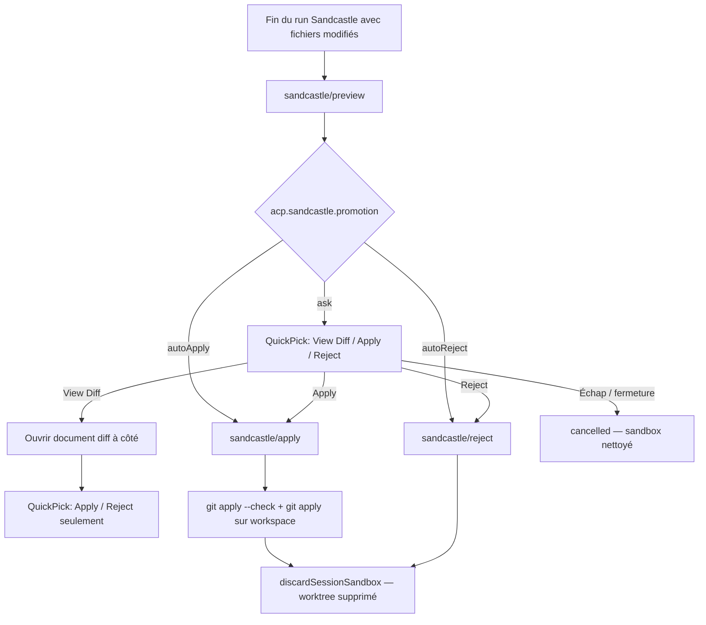

# Sandcastle — changements en cours (promotion Apply/Reject)

**Branche de travail :** `feature/grer-sandbox-avec-sandcastle`  
**Complète :** [docs/sandcastle-changelog-fr.md](../docs/sandcastle-changelog-fr.md) (POC Sandcastle global)  
**Architecture :** [docs/sandcastle-architecture.md](../docs/sandcastle-architecture.md) · [ADR-0011 — sandbox worktree](adr/0011-sandbox-worktree.md)

---

## Résumé

La branche intègre **Sandcastle** (agents Codex/Cursor dans Docker + worktree Git isolé). Le [changelog Sandcastle](../docs/sandcastle-changelog-fr.md) décrit déjà le POC complet ; **ce document couvre le delta en cours** : refonte de l’UI de promotion Apply/Reject, le réglage `acp.sandcastle.promotion`, et l’auto-approbation des permissions ACP dans le sandbox.

Si vous ne comprenez pas « la modale Apply/Reject », l’essentiel est ici : l’agent modifie un **worktree isolé** ; rien n’atteint votre workspace principal tant que vous n’**appliquez** pas explicitement le patch (ou que `autoApply` ne le fait pas pour vous).

---

## Changements fonctionnels en cours

Quatre évolutions visibles par rapport au POC Sandcastle déjà documenté :

| Évolution | Avant (POC actuel) | Après (en cours) |
|-----------|-------------------|------------------|
| **UI de promotion** (mode `ask`) | **Modale historique** : `showInformationMessage` modal avec boucle `while (true)` ; « View Diff » ramène indéfiniment aux 3 boutons | **Palette QuickPick actuelle** : titre « Sandcastle changes ready » ; après View Diff, seulement Apply / Reject (pas de boucle) |
| **Modes automatiques** | Inexistants — toujours une interaction utilisateur en fin de run pipeline | `acp.sandcastle.promotion` : `ask` (défaut), `autoApply`, `autoReject` |
| **Permissions dans le sandbox** | Prompts ACP normaux (`acp.autoApprove.*` par type d’outil) | Connexions Sandcastle : toutes les permissions auto-approuvées (`autoApproveAll`) |
| **0 fichier modifié** | Rejet silencieux via `discard()` + message | Inchangé fonctionnellement ; message « Sandcastle run completed with no file changes. » |

### Quand l’UI de promotion apparaît-elle ?

Deux chemins utilisateur distincts :

| Contexte | Comportement |
|----------|--------------|
| **(A) Chat session persistante** | **Pas de popup automatique** à la fin d’un prompt. L’utilisateur utilise les commandes palette : `ACP: Sandcastle Show Diff`, `ACP: Sandcastle Apply Changes`, `ACP: Sandcastle Reject Changes`. |
| **(B) Pipeline / run éphémère** (`AcpAgentRunner`, `sideEffects: 'workspace'`) | `SandcastlePromotionUi.promote()` est appelé **automatiquement** à la fin du run (selon le mode `acp.sandcastle.promotion`). |
| **Steps pipeline read-only** (`sideEffects` ≠ `workspace`) | `discard()` silencieux — pas d’UI, sandbox détruit sans toucher le workspace. |

**Pourquoi je ne vois pas toujours la modale ?** Parce que le chat persistant n’ouvre pas `promote()` tout seul : seuls les runs pipeline avec effets workspace le font. Et si `acp.sandcastle.promotion` vaut `autoApply` ou `autoReject`, il n’y a pas d’UI du tout.

---

## Apply/Reject : guide complet

### Contexte métier

1. L’agent Sandcastle travaille dans un **conteneur Docker** avec un worktree Git sous une branche `sandcastle/acp/<provider>/<uuid>`.
2. Le **workspace principal** (`session.cwd`) reste intact pendant tout le run.
3. **Apply** et **Reject** forment la **gate de promotion** : seule porte vers le dépôt que vous voyez dans VS Code. Ce concept remplace le sandbox legacy décrit dans [ADR-0011](adr/0011-sandbox-worktree.md) (« yolo contrôlé » : liberté dans l’isolation, revue avant promotion).

### Diagramme de flux (mode `ask`)



### Détail de chaque action

| Action | UI | Appel bridge | Effet Git / filesystem |
|--------|-----|--------------|------------------------|
| **View Diff** | Ouvre un document `.diff` à côté (métadonnées branche + patch binaire) | Aucun (preview déjà obtenu) | Lecture seule |
| **Apply** | Toast succès ou erreur | `sandcastle/apply` | Patch écrit en fichier temporaire → `git apply --check` puis `git apply` sur le **workspace principal** → sandbox détruit |
| **Reject** | Toast confirmation | `sandcastle/reject` | Aucune modification du workspace → sandbox détruit |
| **Annuler** (QuickPick fermé avec Échap) | Rien | `sandcastle/reject` par le runner | Pipeline `cancelled`, sandbox éphémère détruit, reviewer/tester non exécutés |

**Apply modifie quoi exactement ?** Le patch Git est appliqué sur `session.cwd` (votre workspace VS Code), **pas** sur le worktree Docker. Le worktree sert uniquement à produire le diff et à isoler l’agent.

### Modale historique vs palette QuickPick actuelle

**Avant — modale historique** (`showInformationMessage` avec `{ modal: true }`) :

```typescript
while (true) {
  const choice = await vscode.window.showInformationMessage(
    `Sandcastle run changed ${preview.filesChanged} file(s).`,
    { modal: true },
    'View Diff', 'Apply', 'Reject',
  );
  if (choice === 'View Diff') {
    await this.showDiff(preview);
    continue; // ← boucle : retour aux 3 boutons indéfiniment
  }
  // ...
}
```

**Après — palette QuickPick actuelle** : la fonction `promptPromotionChoice(connection, sessionId, preview, allowViewDiff)` :

- **1er affichage** (`allowViewDiff = true`) : 3 items — View Diff, Apply, Reject.
- **Après View Diff** : rappel avec `allowViewDiff = false` → 2 items — Apply, Reject seulement.
- **View Diff boucle-t-il ?** Non, depuis ce changement.

Le test de régression `promote ask shows apply/reject only once after viewing diff` vérifie `quickPickCalls === [3, 2]` (deux appels QuickPick, pas une boucle infinie).

### Modes `acp.sandcastle.promotion`

| Mode | Comportement | Équivalent utilisateur |
|------|--------------|------------------------|
| `ask` (défaut) | QuickPick comme ci-dessus | Revue explicite |
| `autoApply` | `preview` → `apply` sans UI | Yolo avec validation Git (`git apply --check` avant application) |
| `autoReject` | `preview` → `reject` sans UI | Discard systématique des changements |

**Que fait `autoApply` ?** À la fin d’un run pipeline avec fichiers modifiés, l’extension appelle `sandcastle/apply` directement : le patch est validé puis appliqué au workspace, le sandbox est nettoyé, sans QuickPick ni modale.

### Cas limites

| Situation | Comportement |
|-----------|--------------|
| **0 fichier modifié** | `filesChanged === 0` → `discard()` + outcome `no_changes` → reviewer/tester continuent |
| **Échec `git apply`** | Toast d’erreur → pipeline `error`, reviewer/tester non exécutés |
| **Reject via commande palette** | Une **modale de confirmation** séparée (« Reject all changes… ») — distincte du QuickPick de `promote()` |
| **Fermeture du QuickPick** | Outcome `cancelled` ; le runner détruit le worktree et arrête le pipeline |

### Commandes manuelles (chat persistant)

Enregistrées dans `RegisterCommands.ts` :

| Commande VS Code | Rôle |
|------------------|------|
| `acp.sandcastle.showDiff` | `preview` + ouverture du document diff |
| `acp.sandcastle.apply` | Apply direct (sans QuickPick de `promote()`) |
| `acp.sandcastle.reject` | Modale de confirmation, puis `reject` |

`resolveActiveSandcastle()` vérifie qu’une session active utilise bien un agent `transport: "sandcastle"`.

---

## Changements techniques en cours

Tableau des fichiers touchés par ce delta (par rapport au POC déjà mergé sur la branche) :

| Fichier | Rôle du changement |
|---------|-------------------|
| `package.json` | Déclaration du réglage `acp.sandcastle.promotion` (`ask` \| `autoApply` \| `autoReject`) |
| `.vscode/settings.json` | Exemple local (ex. `autoApply`) — **pas** le défaut produit |
| `src/sandcastle/SandcastlePromotionUi.ts` | QuickPick, `getPromotionMode()`, `promptPromotionChoice()`, orchestration `promote()` |
| `src/handlers/PermissionHandler.ts` | Option `autoApproveAll` : court-circuite tous les prompts permission |
| `src/core/ConnectionManager.ts` | Passe `PermissionHandlerOptions` au handler à la connexion |
| `src/core/SessionManager.ts` | `autoApproveAll: isSandcastleAgentConfig(config)` pour les sessions chat |
| `src/pipeline/AcpAgentRunner.ts` | Idem pour les runs pipeline éphémères ; appelle `promote()` ou `discard()` |
| `src/test/sandcastle/SandcastlePromotionUi.test.ts` | Tests `autoApply` / `autoReject` + QuickPick sans boucle après View Diff |
| `src/test/handlers/PermissionHandler.test.ts` | Test `autoApproveAll` |
| `README.fr.md` | Lien vers ce document |

### Chaîne bridge ACP (`extMethod`)

Point d’entrée côté bridge : `SandcastleAcpAgent.extMethod()`.

| Méthode | Implémentation |
|---------|----------------|
| `sandcastle/preview` | `collectPreview()` : `git add --intent-to-add`, `git diff --binary <baseRef>`, compte les fichiers |
| `sandcastle/apply` | Écrit le diff en `.patch` temporaire → `git apply --check` + `git apply` sur `session.cwd` → `discardSessionSandbox()` |
| `sandcastle/reject` | `discardSessionSandbox()` : `git reset --hard`, `git clean -fd`, fermeture du sandbox Docker |

La branche sandbox est créée dans `ensureSandbox()` : `sandcastle/acp/<provider>/<uuid>` à partir du `HEAD` courant du workspace.

### Orchestration UI

- **`SandcastlePromotionUi.promote()`** — lit le mode, appelle `preview`, puis UI ou action automatique.
- **`SandcastlePromotionUi.discard()`** — appelle `sandcastle/reject` sans UI (pipeline read-only, 0 fichier).

---

## Permissions sandbox vs gate de promotion

Trois gates à distinguer pour les équipes/pipelines avec implementer Sandcastle :

| Gate | Quand | Comportement |
|------|-------|--------------|
| **0. Approbation du plan** | Après le planner, avant l’implementer | Interrupt humaine obligatoire — **indépendante** de `acp.sandcastle.promotion` |
| **1. Pendant le run** | L’agent lit/écrit/exécute dans le worktree | `autoApproveAll` sur les connexions Sandcastle → **aucun prompt** permission ACP |
| **2. Après le run** | Promotion vers le workspace principal | Gate Apply/Reject (ou mode auto via `acp.sandcastle.promotion`) |

```
planner → [GATE 0 : humain — plan] → implementer (sandbox) → [GATE 2 : Sandcastle — patch] → reviewer
```

`acp.sandcastle.promotion: autoApply` n’affecte que la **gate 2**. Voir [doc_fr/agent-teams.md](agent-teams.md) — section « Deux gates ».

C’est le « yolo contrôlé » d’[ADR-0011](adr/0011-sandbox-worktree.md) adapté à Sandcastle : le risque est contenu par l’isolation Docker/worktree, pas par des popups répétés à chaque outil. La gate Git (`apply --check`) reste le filet avant d’écrire dans le workspace.

---

## Réglages VS Code concernés

| Réglage | Valeurs | Effet |
|---------|---------|-------|
| `acp.sandcastle.promotion` | `ask` (défaut), `autoApply`, `autoReject` | Comportement de `promote()` en fin de run pipeline **implementer** — n'auto-approuve **pas** le plan |
| `acp.autoApprove.read` / `.edit` / `.execute` | `ask`, `allow` | Agents **natifs** uniquement ; ignorés quand `autoApproveAll` est actif (Sandcastle) |
| `acp.autoApprovePermissions` | `ask`, `allowAll` | Réglage global legacy ; distinct de la gate Sandcastle |

---

## Références et tests

### Documentation interne

- [Changelog Sandcastle (POC)](../docs/sandcastle-changelog-fr.md)
- [Architecture Sandcastle](../docs/sandcastle-architecture.md)
- [ADR-0011 — sandbox worktree](adr/0011-sandbox-worktree.md)
- [ADR-0013 — bridge ACP Sandcastle](../docs/adr/0013-acp-sandcastle-bridge.md)

### Tests unitaires (preuve de comportement)

| Fichier | Ce qu’il vérifie |
|---------|------------------|
| `src/test/sandcastle/SandcastlePromotionUi.test.ts` | `discard` → `sandcastle/reject` ; 0 fichier → auto-discard ; modes auto ; QuickPick `[3, 2]` après View Diff |
| `src/test/sandcastle/SandcastleAcpAgent.test.ts` | Chaîne preview → apply/reject ; patch appliqué au repo principal |
| `src/test/handlers/PermissionHandler.test.ts` | `autoApproveAll` approuve sans QuickPick |

### Smoke tests E2E

```bash
npm run sandcastle:smoke:codex    # Apply doit transférer un fichier sentinelle
npm run sandcastle:smoke:cursor   # Reject doit garder le workspace principal intact
```

---

## FAQ rapide

| Question | Réponse |
|----------|---------|
| Comment promouvoir en **chat Codex Sandcastle** ? | Commandes palette Show Diff → Apply (ou Reject). Pas de popup auto. |
| View Diff boucle-t-il ? | Non avec le QuickPick actuel ; oui avec l’ancienne modale. |
| Je ferme le QuickPick sans choisir ? | Pipeline annulé, sandbox éphémère nettoyé, aucune revue lancée. |
| `autoApply` est-il sans risque ? | L’agent a eu carte blanche *dans* le sandbox ; `autoApply` saute seulement la revue humaine, pas `git apply --check`. |
