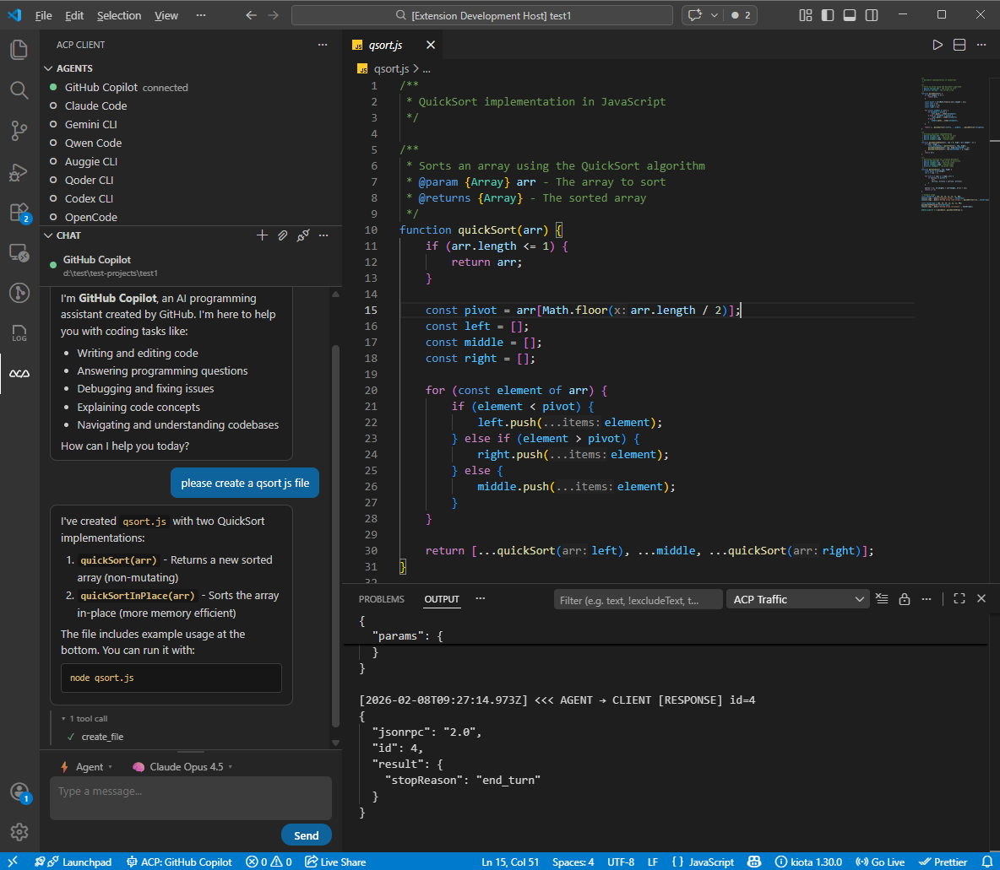

# ACP Client pour VS Code

Une extension VS Code qui joue le role de client [Agent Client Protocol (ACP)](https://agentclientprotocol.com/). Elle permet de connecter des agents IA de dev (Copilot, Claude Code, Codex, Gemini CLI, etc.) directement dans l'editeur.



## Pourquoi ce projet existe

Le but est d'offrir une interface unique dans VS Code pour piloter des agents ACP, sans changer d'outil. Le projet gere :

- le lancement des agents en processus locaux
- la connexion ACP (JSON-RPC sur stdio)
- les sessions de chat
- les outils exposes par les agents (fichiers, terminal, permissions)
- une UI chat avec rendu Markdown, blocs d'outils et choix mode/modele

## Fonctionnalites principales

- Multi-agents : plusieurs configurations possibles, un agent actif a la fois
- Chat integre : historique, rendu Markdown, streaming du texte assistant
- Appels d'outils : affichage des tool calls dans la conversation
- Modes/modeles : selecteurs dans la toolbar du chat
- Permissions : demande utilisateur via QuickPick, avec option auto-approve
- Integration fichiers : lecture/ecriture via API VS Code
- Integration terminal : execution commande + recuperation sortie
- Logs protocole : canal dedie pour inspecter tout le trafic ACP
- Registre ACP : parcours des agents publies dans le registry CDN

## Architecture du code

Le code est organise de maniere modulaire :

- `src/extension.ts` : point d'entree VS Code (activation, commandes, wiring global)
- `src/core/` : orchestration des processus, connexions ACP et sessions
- `src/handlers/` : gestion des capacites ACP (fichiers, terminal, permissions, updates)
- `src/ui/` : tree view agents, status bar, webview chat
- `src/config/` : lecture des settings et client du registry
- `src/utils/` : logging, telemetrie, adaptation de flux

### Composants coeur

- `AgentManager` : demarre/arrete les processus agents
- `ConnectionManager` : cree `ClientSideConnection` ACP et initialise le handshake
- `SessionManager` : gere session active, prompts, annulation, mode/modele, auth
- `AcpClientImpl` : implementation des callbacks client ACP, delegues aux handlers

### Handlers

- `FileSystemHandler` : `readTextFile` / `writeTextFile` via API VS Code
- `TerminalHandler` : creation terminal, polling output, wait/kill/release
- `PermissionHandler` : UI de validation des permissions demandees par agent
- `SessionUpdateHandler` : diffusion des notifications `session/update`

### UI

- `SessionTreeProvider` : liste des agents configures et etat de connexion
- `ChatWebviewProvider` : interface de chat, rendu Markdown, JS/CSS embarques
- `StatusBarManager` : indicateur rapide de connexion en barre d'etat

## Cycle de vie d'une conversation

1. L'utilisateur lance `ACP: Connect to Agent`.
2. `SessionManager` demande a `AgentManager` de spawn l'agent.
3. `ConnectionManager` cree la connexion ACP et appelle `initialize`.
4. `SessionManager` cree `session/new` (et gere auth si necessaire).
5. Le webview chat est notifie de la session active.
6. Un prompt utilisateur est envoye via `prompt`.
7. Les `session/update` alimentent le streaming et les blocs outils.
8. Fin de tour : stop reason, usage, mise a jour UI.

## Prerequis

- Node.js 18+
- VS Code 1.85+
- Un agent ACP disponible (souvent via `npx`)

## Installation et dev local

```bash
git clone https://github.com/formulahendry/vscode-acp.git
cd vscode-acp
npm install
```

### Compiler

```bash
npm run compile
```

### Mode watch (dev)

```bash
npm run watch
```

Puis ouvrir le projet dans VS Code et appuyer sur `F5` pour lancer l'Extension Development Host.

## Tests

```bash
npm run pretest
npm test
```

## Configuration utilisateur

La cle principale est `acp.agents` (objet de configurations). Exemple :

```json
{
  "acp.agents": {
    "Mon Agent": {
      "command": "npx",
      "args": ["-y", "@mon-org/agent-acp@latest"],
      "env": {
        "MON_TOKEN": "..."
      }
    }
  },
  "acp.autoApprovePermissions": "ask",
  "acp.defaultWorkingDirectory": "",
  "acp.logTraffic": true
}
```

### Parametres importants

- `acp.autoApprovePermissions` : `ask` ou `allowAll`
- `acp.defaultWorkingDirectory` : repertoire de travail par defaut
- `acp.logTraffic` : active/desactive le canal de trafic JSON-RPC

## Commandes exposees

Exemples de commandes utiles dans la palette (`Ctrl+Shift+P`) :

- `ACP: Connect to Agent`
- `ACP: New Conversation`
- `ACP: Cancel Current Turn`
- `ACP: Restart Agent`
- `ACP: Set Agent Mode`
- `ACP: Set Agent Model`
- `ACP: Browse Agent Registry`
- `ACP: Show Log`
- `ACP: Show Protocol Traffic`

## Observabilite

Deux canaux de sortie sont utilises :

- `ACP Client` : logs fonctionnels de l'extension
- `ACP Traffic` : messages ACP entrants/sortants (si `acp.logTraffic=true`)

## Limites connues

- L'agent doit etre executable dans l'environnement local (PATH, npx, etc.)
- Certains agents exigent une authentification externe
- La fonctionnalite d'attachement de fichier est presente mais depend du comportement agent

## Packaging

```bash
npm run package
npx @vscode/vsce package
```

## Liens

- [Marketplace VS Code](https://marketplace.visualstudio.com/items?itemName=formulahendry.acp-client)
- [Agent Client Protocol](https://agentclientprotocol.com/)
- [Depot GitHub](https://github.com/formulahendry/vscode-acp)

## Licence

MIT. Voir [LICENSE](LICENSE).
